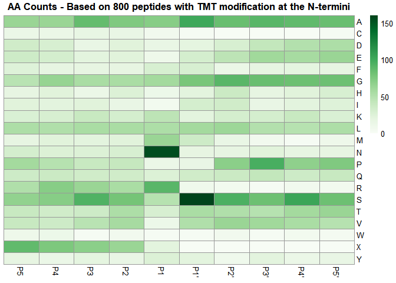

# TermineR: extracting information on endogenous proteolytic processing
from shotgun proteomics data.


- [Installation](#installation)
  - [Requisites](#requisites)
- [Usage at a glance](#usage-at-a-glance)
  - [Adapter functions](#adapter-functions)
  - [Peptide annotation](#peptide-annotation)
  - [Visualization of cleavage sites](#visualization-of-cleavage-sites)
  - [Differential abundance analysis](#differential-abundance-analysis)
- [Minimal example](#minimal-example)
- [Extended example](#extended-example)

# Installation

You can install the development version of *TermineR* adapter,
annotation and visualization functions from GitHub with:

``` r
if (!require("TermineR", quietly = TRUE))
{        
    devtools::install_github("MiguelCos/TermineR")
}
```

## Requisites

In order to install the *TermineR* package from Github, you will need to
have the following software and packages installed:

### Rtools

If you are using Windows, you will need to install Rtools. You can
download the latest version of Rtools from the following link:
https://cran.r-project.org/bin/windows/Rtools/

### devtools

You will also need to have the `devtools` package installed. You can
install it by running the following command:

``` r
if (!require("devtools", quietly = TRUE))
{        
    install.packages("devtools")
}
```

### BiocManager

You will also need to have the `BiocManager` package installed. You can
install it by running the following command:

``` r
if (!require("BiocManager", quietly = TRUE))
{        
    install.packages("BiocManager")
}
```

### Required packages for the terminomics analysis workflow

The following packages are required to run the terminomics analysis
workflow:

- `tidyverse`
- `limma`
- `clusterProfiler`
- `org.Mm.eg.db`
- `here`
- `janitor`
- `seqinr`
- `ggpubr`
- `ggsignif`
- `ggrepel`
- `SummarizedExperiment`
- `pheatmap`
- `RColorBrewer`
- `diann` (installation from Github required)

Notice that some of these packages are not available in the CRAN
repository and need to be installed from Bioconductor or via `devtools`
from Github (such as the `TermineR`package). You can install them by
running the following commands:

``` r
# Install CRAN packages
install.packages(c("tidyverse", "here", "janitor", "seqinr", "ggpubr", "ggsignif", "ggrepel", "pheatmap", "RColorBrewer"))

# Install Bioconductor packages
BiocManager::install(c("limma", "clusterProfiler", "org.Mm.eg.db", "SummarizedExperiment"))

# Install packages from Github (diann)
devtools::install_github("https://github.com/vdemichev/diann-rpackage")
```

# Usage at a glance

The *TermineR* package provides a set of functions to extract
information on endogenous proteolytic processing from shotgun proteomics
data.

## Adapter functions

The adapter functions are used to prepare the data for the terminomics
analysis workflow. Currently the package provides adapter functions for
FragPipe, DiaNN and Spectronaut search results.

At a glance, the adapter functions would mine PSM or precursor level
results from the search engines and standardize feature abundances for
further analysis. The output would be a data frame with standardized
abundances per sample and at least 4 feature columns:

- `nterm_modif_peptide`: N-terminal modified peptide sequence.
- `nterm_modif`: N-terminal modification. (`n` for no modification,
  `Acetyl`, `TMT` or `Dimethyl`; for `diann_adapter`, the N-terminal
  modification would follow the UniMod notation).
- `peptide`: Stripped peptide sequence.
- `protein`: Protein accession number.

### FragPipe adapter

This function will process peptide-to-spectrum match (PSM) data
generated by the FragPipe search engine for a TMT experiment.

The function will group the PSMs by the selected grouping criteria
(i.e., `nterm_modif_peptide` for N-terminal modified peptides) and
select the best PSM per feature for quantitation based on isobaric
purity and total sum of reporter ion intensities. It will then perform
standadization of the reporter ion intensities based on MAD scaling (as
described [here](https://doi.org/10.1016/j.cell.2019.10.007)).

The basic usage of the `fragpipe_adapter` function is as follows:

``` r
fragpipe_adapter(
  parent_dir,
  ref_sample = NULL,
  grouping_var = "nterm_modif_peptide",
  min_purity = 0.5,
  tmt_delta = "229"
)
```

Where:

- `parent_dir` is the path to the directory containing the FragPipe
  search results. (Make sure you don’t have additional folders inside
  the parent directory, rather than only those generated by the FragPipe
  search).
- `ref_sample` is the reference sample used for the TMT quantification,
  in case of multi-mixture experiments. In case of single-mixture
  experiments, `ref_sample` should be set to `NULL`.
- `grouping_var` is the variable used to group the peptides. By default,
  the grouping is done by the N-terminal modified peptide sequence
  (`"nterm_modif_peptide"`).
- `min_purity` is the minimum purity threshold for the peptides. By
  default, the threshold is set to 0.5.
- `tmt_delta` is the mass difference between the TMT reporter ions.
  “229” for 10-plex TMT experiments and “304” for 16-plex TMT
  experiments.

### DiaNN adapter

This function will process precursor-level data generated by DiaNN. It
will extract peptide-level quantitative information from the
`report.tsv` (precursor-level output) and perform standardization of the
intensities based on MAD scaling. It will annotate N-terminal
modifications based on UniMod notation, and generate features of
N-terminal modification + peptide sequence.

The basic usage of the `diann_adapter` function is as follows:

``` r
diann_adapter(
  path_to_file,
  proteotypic  = TRUE
)
```

Where:

- `path_to_file` is the path to the `.tsv` file containing the DiaNN
  precursor level results (usually called `report.tsv`).
- `proteotypic` is a logical value to indicate if only proteotypic
  peptides should be considered. By default, the value is set to `TRUE`.

### Spectronaut adapter

This function will process precursor-level data generated by
Spectronaut. It will extract peptide-level quantitative information and
perform log2-transformation of the intensities. Currently the function
only supports annotation of `Acetyl` N-terminal modifications. Other
modifications will be included in future versions.

The basic usage of the `spectronaut_adapter` function is as follows:

``` r
spectronaut_adapter(
  path_to_file,
  proteotypic  = TRUE
)
```

Where:

- `path_to_file` is the path to the `.tsv` file containing the
  Spectronaut precursor level results.
- `proteotypic` is a logical value to indicate if only proteotypic
  peptides should be considered. By default, the value is set to `TRUE`.

### Fragpipe label-free adapter

This function will process peptide-to-spectrum match (PSM) data
generated by the FragPipe search engine for a label-free experiment.

The function will summarize the PSMs by the selected grouping criteria
(i.e., `nterm_modif_peptide` for N-terminal modified peptides) and will
then perform standadization of the feature intensties based on MAD
scaling (as described
[here](https://doi.org/10.1016/j.cell.2019.10.007)). Currently the
function is compatible with the annotation of light and heavy Dimethyl
modifications (delta = 28.031/36.075 Da) and acetyl at the N-termini.

The basic usage of the `fragpipe_lf_adapter` function is as follows:

``` r
fragpipe_lf_adapter(
  parent_dir,
  annotation_file_path,
  grouping_var = "nterm_modif_peptide")
```

Where:

- `parent_dir` is the path to the directory containing the FragPipe
  search results. If the search was performed setting up different
  experiments, the function will look for the `psm.tsv` files per each
  experiment folder and merge them. Make sure to avoid having additional
  folders inside the parent directory, rather than only those generated
  by the FragPipe search.
- `grouping_var` is the variable used to group the peptides. By default,
  the grouping is done by the N-terminal modified peptide sequence
  (`"nterm_modif_peptide"`).
- `annotation_file_path`: path to an `annotation.txt` file, containing
  at least two columns:
  - `run`: the name of the LC-MS/MS runs. The names should match the
    names of the search files in the `psm.tsv` output files.
  - `sample`: sample name. Can be user-define. Usually defines the
    experimental condition and the biological replicate number.
  - An example of this file can be found in this repo [here]().

We have included a minimal example on the usage of the
`fragpipe_lf_adapter` function in the [label-free example workflow]().

## Peptide annotation

The peptide annotation functions are used to annotate the peptides
processed by the adapter functions with information on proteolytic
specificity, cleavage sites/sequences, and mapping to known processing
events as described in the by Uniprot “Protein Processing” features.

The basic usage of the `annotate_peptides` function is as follows:

``` r
annotate_neo_termini(
  peptides_df,
  fasta_location,
  sense,
  specificity,
  organism = "mouse"
)
```

Where:

- `peptides_df` is the data frame containing the peptides processed by
  the adapter functions.
- `fasta_location` is the path to the FASTA file containing the
  identified protein sequences. The user can define the fasta used in
  the search. It is required that the fasta is in Uniprot/EBI proteomics
  format.
- `sense` is the sense of the cleavage site. It can be either `"N"` for
  N-terminal cleavage or `"C"` for C-terminal cleavage.
- `specificity` is the specificity of the cleavage site.
  - Note: the `sense` and `specificity` arguments can be combined to
    define experimental protease used for digestion. Examples:
    - Trypsin would require `sense = "C"` and `specificity = "K|R"`.
    - Lysarginase would require `sense = "N"` and `specificity = "K|R"`.
- `organism` is the organism used in the search. By default, the value
  is set to `"mouse"`. Currently `"human"`, `"mouse"`,
  `"mendicato_trucantula"` and `"rhizobium_melitoli"`, `"pig"`, `"arabidopsis"`, `"ecoli"`, `"rat"`, `"yeast"` are
  supported. Other organisms available in Uniprot can be included upon
  request.

## Visualization of cleavage sites

After identifying a set of peptides or cleavage events of interest
(i.e., after differential abundance analysis, see below), the user can
visualize them by using a heatmap of amino acid abundances around the
cleavage site. We provide the function `cleavage_area_matrix`, which
takes a character vector of amino acid sequences representing cleavage
areas of interesting cleavage events (as obtained from the
`cleavage_sequence` column after annotation with the
`annotate_neo_termini` function.), and returns a matrix of amino acid
abundances around the cleavage site.

This matrix can be then used within the `pheatmap` function from the
`pheatmap` package to generate a heatmap of amino acid abundances around
the cleavage site.

The basic usage of the `cleavage_area_matrix` function is as follows:

``` r
cleavage_area_matrix(
  peptides, 
  p_number = 5)
```

Where:

- `peptides` is a character vector of amino acid sequences representing
  cleavage areas of interesting cleavage events.
- `p_number` is the number of amino acids to be shown in the heatmap,
  before and after the cleavage site. By default, the value is set to 5
  for a cleavage area between P5 and P5’.

## Differential abundance analysis

The differential abundance analysis functions are used to identify
peptides or cleavage events that are differentially abundant between two
or more conditions. Our terminomics analysis example workflow uses the
*limma* package to perform the differential abundance analysis, and we
provide a function (`feature_fdr_correction`) for the feature-specific
FDR correction of the peptides defined by the user as proteolytic
products.

It applies multiple-testing p-value adjustment on specified features.
This approach is based on the idea of independent hypothesis weighting,
where the FDR is calculated for a subset of interesting features
independently of the tested hypothesis of differential abundance, as
described by [Ignatiadis et
al. 2016](https://doi.org/10.1038/nmeth.3885). Depending on the
distribution of p-values, this method can offer increased sensitivity
for the detection of differentially abundant features.

For a specific example on how to use the `feature_fdr_correction`
function, please refer our terminomics analysis example workflow. But at
a glance, the basic usage of the `feature_fdr_correction` function is as
follows:

``` r
feature_fdr_correction(
  toptable,
  interesting_features_table,
  method = "BH"
)
```

Where:

- `toptable` is the topTable object generated by the `limma::topTable`
  function, after differential abundance analysis. It should include a
  column named `nterm_modif_peptide`, containing the N-terminal modified
  peptide sequences tested.
- `interesting_features_table`: A subset of the peptide data annotation
  data frame obtained from the `annotate_neo_termini` function. It
  should contain the list of features that can be defined as
  ‘neo-termini’ under the user criteria. Example: All peptides with TMT
  modification at the N-termini.
- `method` is the method used for multiple testing correction. By
  default, the value is set to `"BH"`.

# Minimal example

**Execute adapter function**

``` r
# Load the TermineR package
library(TermineR)

# Define the path to the directory containing the FragPipe search results
fragpipe_out_location <-  here::here("data-raw/pkd_mouse_model_search")
```

``` r
# Execute the adapter function
df_from_fragpipe <- fragpipe_adapter(
  parent_dir = fragpipe_out_location,
  ref_sample = NULL, # it is important to define as NULL for mono mixtures
  grouping_var = "nterm_modif_peptide",
  tmt_delta = "304")
```

**Peptide annotation**

``` r
# Define the path to the FASTA file containing the identified protein sequences
fasta_location <- here::here("data-raw/pkd_mouse_model_search/protein.fas")

# Execute the annotation function
annotated_peptides <- annotate_neo_termini(
  peptides_df = df_from_fragpipe,
  fasta_location = fasta_location,
  sense = "C", 
  specificity = "K|R", # sence C and specificity K|R for trypsin digestion
  organism = "mouse"
)
```

**Visualize the number of peptides with TMT/Acetyl modification at the
N-termini by their annotated Uniprot Processing type**

``` r
count_matches  <- annotated_peptides %>%
  filter(
    # we keep all peptides with TMT or Acetyl modification at the N-termini
    nterm_modif != "n",
    # exclude peptides with no categorization for Uniprot processing information
    !is.na(uniprot_processing_type)) %>%
  dplyr::count(uniprot_processing_type) %>%
  mutate(
    uniprot_processing_type = factor(
      uniprot_processing_type, 
      levels = c(
        "SIGNAL",
        "PROPEP",
        "TRANSIT",
        "INIT_MET",
        "INIT_MET_not_canonical",
        "Intact_ORF",
        "not_canonical"
      )
    )
  )
```

``` r
# Load the ggplot2 package
library(ggplot2)

count_matches_plot <- ggplot(count_matches,
       aes(x = uniprot_processing_type, y = n)) +
           coord_flip() +
           geom_bar(stat = "identity") +
           geom_text(aes(label = n), hjust = -0.01, size = 5) +
           ylim(0, max(count_matches$n) + 300) +
           labs(title = "Nr of N-terminal peptides by their Uniprot category") +
           labs(y = "Number of Peptides by matching type",
                x = "Type of matching processing information") +
            theme(axis.text.x = element_text(hjust = 1, size = 10),
                  axis.text.y = element_text(hjust = 1, size = 10),
                  panel.background = element_blank(),
                  panel.grid.major = element_line(color = "grey"),
                  panel.border = element_rect(fill=NA, linewidth=1.5),
                  axis.title=element_text(size=12,face="bold"))

print(count_matches_plot)
```


**Select interesting features and visualize**

We will select a sample of 800 peptides with TMT modification at the
N-termini. We will then visualize the amino acid counts around the
cleavage site.

``` r
# Select interesting features
interesting_features <- annotated_peptides %>% 
  filter(
    # we keep all peptides with TMT modification at the N-termini
    # we define these as neo-termini and potential proteolytic products
    nterm_modif == "TMT") %>%
  # select a sample from these dataset of 800 peptides
  sample_n(800) %>%
  mutate(
    cleavage_area_len = nchar(cleavage_sequence)
  ) %>%
  filter(cleavage_area_len == 10) 
```

**Generate the amino acid count matrix**

``` r
cleave_are_matrix <- cleavage_area_matrix(
  peptides = interesting_features$cleavage_sequence,
  p_number = 5
)
```

**Visualize the amino acid counts around the cleavage site with the
`pheatmap` package**

``` r
# load the pheatmap package
library(RColorBrewer)
library(pheatmap)

pheatmap(cleave_are_matrix$amino_acid_count, 
        cluster_rows = FALSE,
        cluster_cols = FALSE,
        main = "AA Counts - Based on 800 peptides with TMT modification at the N-termini",
        color = colorRampPalette(brewer.pal(n = 9, name = "Greens"))(100))
```



# Extended example

We provide an extended example workflow in which we use the *TermineR*
package to analyze a dataset of shotgun proteomics data from a mouse
model of polycystic kidney disease (PKD). The dataset was generated by a
TMT experiment and searched with the FragPipe search engine. The
workflow includes differential abundance analysis with the *limma*
package, feature-specific FDR correction, and visualization of the
results. Users can access the extended example in this repository
following this
[link](https://github.com/MiguelCos/TermineR/blob/main/terminomics_analysis_workflow.md).

``` r
sessionInfo()
```

    R version 4.4.0 (2024-04-24 ucrt)
    Platform: x86_64-w64-mingw32/x64
    Running under: Windows 11 x64 (build 22631)

    Matrix products: default


    locale:
    [1] LC_COLLATE=English_United States.utf8 
    [2] LC_CTYPE=English_United States.utf8   
    [3] LC_MONETARY=English_United States.utf8
    [4] LC_NUMERIC=C                          
    [5] LC_TIME=English_United States.utf8    

    time zone: Europe/Berlin
    tzcode source: internal

    attached base packages:
    [1] stats     graphics  grDevices utils     datasets  methods   base     

    other attached packages:
     [1] pheatmap_1.0.12    RColorBrewer_1.1-3 tibble_3.2.1       ggplot2_3.5.1     
     [5] magrittr_2.0.3     seqinr_4.2-30      tidyr_1.3.0        stringr_1.5.1     
     [9] dplyr_1.1.2        purrr_1.0.1        readr_2.1.4        here_1.0.1        
    [13] TermineR_1.0.0    

    loaded via a namespace (and not attached):
     [1] utf8_1.2.4          generics_0.1.3      stringi_1.7.12     
     [4] hms_1.1.3           digest_0.6.33       RcppEigen_0.3.3.9.4
     [7] grid_4.4.0          evaluate_0.23       timechange_0.2.0   
    [10] fastmap_1.1.1       rprojroot_2.0.4     jsonlite_1.8.5     
    [13] fansi_1.0.6         scales_1.3.0        ade4_1.7-22        
    [16] cli_3.6.1           rlang_1.1.1         crayon_1.5.2       
    [19] munsell_0.5.1       bit64_4.0.5         withr_3.0.0        
    [22] yaml_2.3.7          tools_4.4.0         parallel_4.4.0     
    [25] tzdb_0.4.0          colorspace_2.1-0    vctrs_0.6.3        
    [28] R6_2.5.1            lifecycle_1.0.4     lubridate_1.9.2    
    [31] snakecase_0.11.1    bit_4.0.5           vroom_1.6.4        
    [34] MASS_7.3-60         janitor_2.2.0       pkgconfig_2.0.3    
    [37] gtable_0.3.5        pillar_1.9.0        data.table_1.15.4  
    [40] glue_1.6.2          Rcpp_1.0.11         xfun_0.41          
    [43] tidyselect_1.2.0    rstudioapi_0.15.0   knitr_1.45         
    [46] farver_2.1.1        htmltools_0.5.7     labeling_0.4.3     
    [49] rmarkdown_2.25      diann_1.0.1         compiler_4.4.0     
