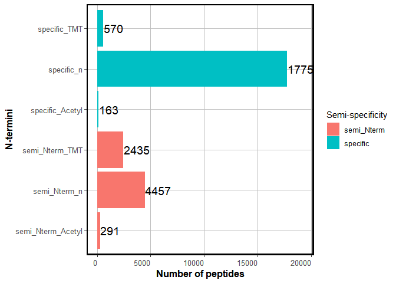
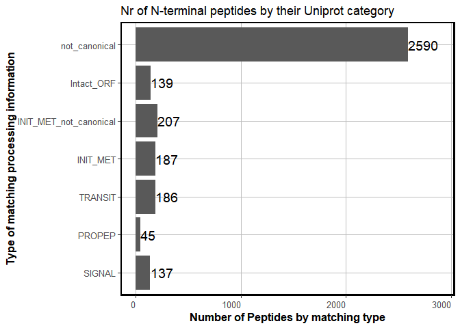
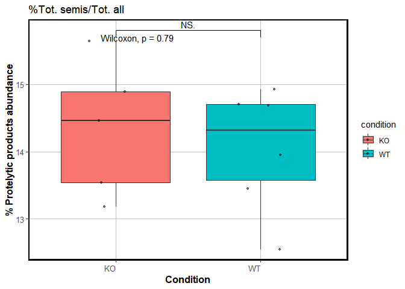
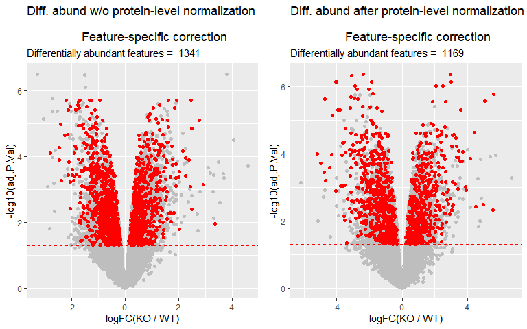
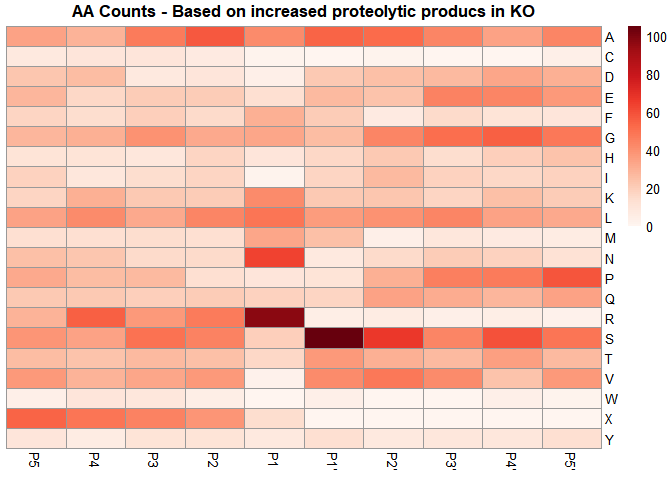
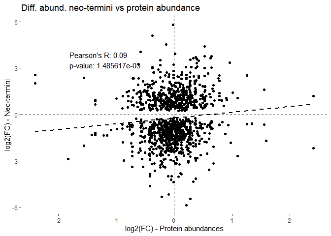
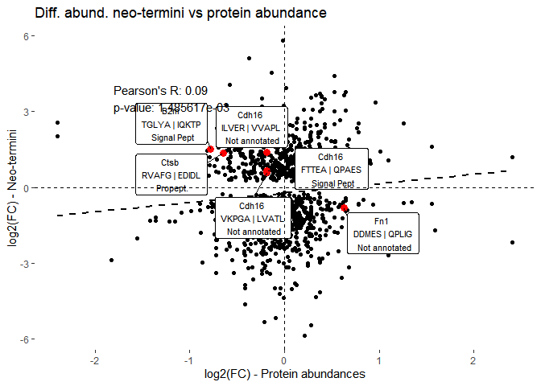
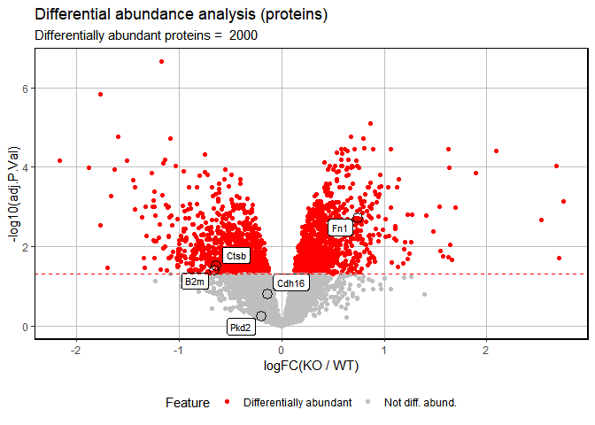

# Terminomics analysis of proteolytic processing in polycystic kidney
disease in mice
Miguel Cosenza-Contreras and Adrianna Seredynska

# Background and general description of the data analysis approach

# General experimental information

In order to showcase the capabilities of modern bioformatics tools in
combination with our data analysis approach to extract information
related to proteolytic processing from shotgun proteomics data
(i.e. without biochemical enrichment), we used a mouse model of
polycystic kidney disease (PKD) and isobaric labeling at the protein
level.

In brief, protein was extracted from 11 Formalin-fixed paraffin-embedded
(FFPE) tissue samples and directly labeled before trypsin digestion
using TMT 11plex. Using this approach, we aimed to identify and quantify
both native and neo N-termini; in the later case, assuming that peptides
TMT-labelled at their N-termini would be those coming from intrinsic
proteolytic processing.

# Short description of database search and quantitation approach

We used the FragPipe (v21.1) bioinformatic pipeline for database search,
re-scoring and quantitation.

In brief, we used MSFragger for peptide-to-spectrum matching against
canonical mouse sequences (EBI reference proteomes, version 2021_04). We
used argc semi-specificity (cleavage only at R), based on the assumption
that trypsin would not cleave at K after TMT labeling. Acetylation at
peptide N-term and TMT-labeling at N-term where both set as variable
modifications. TMT at K and carbamidomethylation of C were set as fixed
modifications.

MSBooster was to predict spectra and retention times which were used as
an input for Percolator for probabilistic rescoring and FDR control of
peptide identifications.

# Required R packages

**TermineR installation and/or loading**

``` r
if (!require("TermineR", quietly = TRUE))
{        
    devtools::install_github("MiguelCos/TermineR")
}
```

**Required R packages**

``` r
## Required packages ----
library(TermineR)

library(tidyverse)
library(limma)
library(clusterProfiler)
library(org.Mm.eg.db)
library(here)
library(janitor)
library(seqinr)
library(ggpubr)
library(ggsignif)
library(ggrepel)
library(SummarizedExperiment)
library(pheatmap)
library(RColorBrewer)
```

# Load required data

## Load the peptide-level quantitation data (`fragpipe_adapter`)

For a FragPipe analysis, we only need to define the location of our
Fragpipe output folder.

``` r
# define the location of the Fragpipe output folder
fragpipe_out_location <-  here::here("data-raw/pkd_mouse_model_search")
```

Then we can use the `fragpipe_adapter` function to generate a data frame
with the peptide-level quantitation information, including standardized
reporter ion intensities, peptide sequences, and N-terminal
modifications.

``` r
df_from_fragpipe <- fragpipe_adapter(parent_dir = fragpipe_out_location,
                                         ref_sample = NULL, # it is important to define as NULL for mono mixtures
                                         grouping_var = "nterm_modif_peptide",
                                         tmt_delta = "304")
```

We define `ref_sample = NULL` because is an experiment with only one TMT
mixture.

## Load sample annotation data

We need a file that provides information regarding the sample names, the
TMT channel used for labeling, and the experimental condition. This file
is used for downstream analysis and plotting.

Our starting annotation file is the `annotation.txt` used for the
TMT-integrator module in FragPipe. Here we generate a modified version
of this file, with the information required for downstream analysis. It
is important that the sample label in the annotation file matches the
name of the quantitative columns in the `psm.tsv` file. This is
particularly interesting for the peptide-to-protein normalization step.

``` r
# load data
sample_annotation <- read_delim(
  here("data-raw/pkd_mouse_model_search/annotation.txt"),
  col_names = FALSE) %>%
  dplyr::rename(
    channel = X1,
    sample = X2)  %>%
  # add condition information
  dplyr::mutate(
    condition = case_when(
      str_detect(sample, "WT") ~ "WT",
      str_detect(sample, "KO") ~ "KO",
      TRUE ~ "empty"
    )
  ) 
```

## Load and prepare protein annotation data

We want to have a series of data frames that allow us to map the protein
IDs to gene symbols and protein descriptions. This is important for
downstream analysis and visualization. We can get that information
directly from the `psm.tsv` file generated by FragPipe in this case.

``` r
psm_tsv <- read_tsv("data-raw/pkd_mouse_model_search/psm.tsv") %>%
  janitor::clean_names()

prot2description <- psm_tsv %>%
  dplyr::select(protein = protein_id, protein_description) %>%
  distinct()

prot2gene <- psm_tsv %>%
  dplyr::select(protein = protein_id,
                gene)
```

# Annotation of peptide specificities

Based on our generated `df_from_fragpipe` object using
`fragpipe_adapter` (summary of modified peptides from PSMs), we can now
annotate the peptide specificities, cleavage sites and map them to
uniprot processing sites. This is done using the `annotate_neo_termini`
function.

For that, we need a fasta file with the protein sequences identified in
the search.

The users that adapt the protease specificy according to their
experiment modifying the `sense` and `specificity` arguments. The
`sense` argument can be “N” (for cleavage before the N-terminal residue)
or “C” (for cleavage after the C-terminal residue) and the `specificity`
argument can be any amino acid or a combination of amino acids.

In this case, we are using “C” and “K\|R” for trypsin-like cleavage.

Users interested in other proteases can modify these arguments
accordingly. For example: Lysarginase would require the user to define
`sense = "N"` and keep specificity “K\|R”.

``` r
annotated_df_quant <- annotate_neo_termini(
  peptides_df = df_from_fragpipe, 
  fasta_location = here::here("data-raw/pkd_mouse_model_search/protein.fas"),
  sense = "C", 
  specificity = "K|R",
  organism = "mouse") %>% 
  mutate(cleav_len = nchar(cleavage_sequence)) %>% 
  relocate(cleav_len, .after = cleavage_sequence)
```

We now have a data frame with the annotated peptides, including the
cleavage site and the specificity of the cleavage. Let’s quickly check
how it looks:

``` r
str(dplyr::select(
  annotated_df_quant, -where(is.numeric)))
```

    tibble [28,778 × 20] (S3: tbl_df/tbl/data.frame)
     $ nterm_modif_peptide    : chr [1:28778] "TMT_AAAAAAAAAAGR" "TMT_AAAAAAATKPAR" "TMT_AAAAAASTSVKPIFSR" "TMT_AAAAAATKPAR" ...
     $ nterm_modif            : chr [1:28778] "TMT" "TMT" "TMT" "TMT" ...
     $ peptide                : chr [1:28778] "AAAAAAAAAAGR" "AAAAAAATKPAR" "AAAAAASTSVKPIFSR" "AAAAAATKPAR" ...
     $ protein                : chr [1:28778] "Q91Z31" "Q99N96" "Q9CQZ5" "Q99N96" ...
     $ last_aa                : chr [1:28778] "R" "R" "R" "R" ...
     $ first_aa               : chr [1:28778] "A" "A" "A" "A" ...
     $ aa_after               : chr [1:28778] "V" "K" "D" "K" ...
     $ aa_before              : chr [1:28778] "N" "F" "Q" "A" ...
     $ sense                  : chr [1:28778] "C" "C" "C" "C" ...
     $ specificity            : chr [1:28778] "semi_Nterm" "semi_Nterm" "semi_Nterm" "semi_Nterm" ...
     $ five_res_before        : chr [1:28778] "LAIPN" "HNRHF" "TGLRQ" "NRHFA" ...
     $ five_res_after         : chr [1:28778] "AAAAA" "AAAAA" "AAAAA" "AAAAA" ...
     $ cleavage_site          : chr [1:28778] "LAIPN | AAAAA" "HNRHF | AAAAA" "TGLRQ | AAAAA" "NRHFA | AAAAA" ...
     $ cleavage_sequence      : chr [1:28778] "LAIPNAAAAA" "HNRHFAAAAA" "TGLRQAAAAA" "NRHFAAAAAA" ...
     $ p1_residue             : chr [1:28778] "N" "F" "Q" "A" ...
     $ p1_prime_residue       : chr [1:28778] "A" "A" "A" "A" ...
     $ met_clipping           : logi [1:28778] FALSE FALSE FALSE FALSE TRUE FALSE ...
     $ matches_p1_prime       : logi [1:28778] FALSE FALSE FALSE FALSE TRUE FALSE ...
     $ uniprot_processing_type: chr [1:28778] "not_canonical" "not_canonical" "not_canonical" "not_canonical" ...
     $ protein_sequence       : Named chr [1:28778] "MDGIVTEVAVGVKRGSDELLSGSVLSSPNSNMSGMVVTANGNDSKKFKGEDKMDGAPSRVLHIRKLPGEVTETEVIALGLPFGKVTNILMLKGKNQAFLELATEEAAITMV"| __truncated__ "MAAAVRCLRRVLIHHQRHCLCKMASQASLYPCSVNSLLHNRHFAAAAAAATKPARKIKKGAKEKTSDEKPVDDIEKIKSYTYMESDPEDDVYLKRLYPRRIYEVEKAIHLL"| __truncated__ "MAAAATGLRQAAAAAASTSVKPIFSRDLNEAKRRVRELYRAWYREVPNTVHLMQLDITVKQGRDKVREMFMKNAHVTDPRVVDLLVIKGKMELQETIKVWKQRTHVMRFFH"| __truncated__ "MAAAVRCLRRVLIHHQRHCLCKMASQASLYPCSVNSLLHNRHFAAAAAAATKPARKIKKGAKEKTSDEKPVDDIEKIKSYTYMESDPEDDVYLKRLYPRRIYEVEKAIHLL"| __truncated__ ...
      ..- attr(*, "names")= chr [1:28778] "sp|Q91Z31|PTBP2_MOUSE" "sp|Q99N96|RM01_MOUSE" "sp|Q9CQZ5|NDUA6_MOUSE" "sp|Q99N96|RM01_MOUSE" ...

The users can check the definitions of each column by calling the
`?annotate_neo_termini` function.

Finally, we will get a simplified version of the `annotated_df_quant`
data frame, mapping peptide sequences to proteins and genes, for
downstream analysis.

``` r
pept2prot2gene <- annotated_df_quant %>%
  dplyr::select(nterm_modif_peptide, protein, peptide) %>%
  left_join(., prot2gene) %>%
  distinct() 

pept2prot <- pept2prot2gene %>%
  dplyr::select(nterm_modif_peptide, protein) %>%
  distinct()
```

# Visualization of peptide counts by N-terminal modification and specificity

Starting with our `annotated_df_quant` data frame, we can extract
information on the number of peptides identified for each N-terminal
modification and specificity. This information can be used to generate a
bar plot showing the distribution of peptides across the different
N-terminal modifications and specificities.

In the chunk below, we count the number of peptides for each N-terminal
modification and specificity, and then generate a bar plot showing the
distribution of peptides across these categories. In this example we are
excluding semi-specific peptides at the C-termini, because we want to
focus on those peptides that were labeled at the N-termini with TMT, as
a proxy for proteolytic products.

In label-free experiments or when labelling after experimental digestion
(i.e., after trypsin digestion), the user can include semi-specific
peptides at the C-termini.

``` r
annot_counts <- annotated_df_quant %>%
  filter(!str_detect(specificity, "semi_Cterm")) %>%
  # count peptides by semi_type and nterm
  dplyr::count(specificity, 
               nterm_modif) %>%
  # add a column with the total number of peptides
  mutate(total = sum(n)) %>%
  # add a column with the percentage of peptides
  mutate(perc = n/total * 100) %>% 
  # create a category column merging semi_type and nterm
  mutate(category = paste(specificity, 
                          nterm_modif, 
                          sep = "_")) 
```

… and then generate the bar plot:

``` r
max_n <- max(annot_counts$n)

semi_counts_barplot <- ggplot(annot_counts,
       aes(x = n, 
           y = category, 
           fill = specificity)) +
  geom_col() +
  geom_text(aes(label = n), 
            hjust = -0.02, 
            size = 5) +
  labs(y = "N-termini", 
       x = "Number of peptides", 
       fill = "Semi-specificity") +
  xlim(0, max(max_n) + 1500) +  # Set the limits here 
  theme(axis.text.x = element_text(hjust = 1, size = 10),
        axis.text.y = element_text(hjust = 1, size = 10),
        panel.background = element_blank(),
        panel.grid.major = element_line(color = "grey"),
        panel.border = element_rect(fill=NA, linewidth=1.5),
        axis.title=element_text(size = 12, face = "bold"))

print(semi_counts_barplot)
```



# Annotation of protein termini by Uniprot-annotated processing information

Our `annotated_df_quant` data frame contains information on the matching
of cleavage events in our dataset with known processing information from
Uniprot. We can use this information to generate a bar plot showing the
distribution of peptides across the different Uniprot processing
categories. We included three additional categories:

- “INIT_MET_not_canonical”: for events of methionine cleavage that are
  not annotated in Uniprot.
- “Intact_ORF”: for N-terminal peptides that represent the canonical
  start of the protein sequence, as annotated in Uniprot.
- “not_canonical”: for N-terminal peptides that do not map to any
  processing event as annotated in Uniprot.

First we prepare the data for the bar plot from the `annotated_df_quant`
data frame:

``` r
count_matches  <- annotated_df_quant %>%
  filter(
    nterm_modif != "n",
    !is.na(uniprot_processing_type)) %>%
  dplyr::count(uniprot_processing_type) %>%
  mutate(
    uniprot_processing_type = factor(
      uniprot_processing_type, 
      levels = c(
        "SIGNAL",
        "PROPEP",
        "TRANSIT",
        "INIT_MET",
        "INIT_MET_not_canonical",
        "Intact_ORF",
        "not_canonical"
      )
    )
  )
```

… and then generate the bar plot:

``` r
count_matches_plot <- ggplot(count_matches,
       aes(x = uniprot_processing_type, y = n)) +
           coord_flip() +
           geom_bar(stat = "identity") +
           geom_text(aes(label = n), hjust = -0.01, size = 5) +
           ylim(0, max(count_matches$n) + 300) +
           labs(title = "Nr of N-terminal peptides by their Uniprot category") +
           labs(y = "Number of Peptides by matching type",
                x = "Type of matching processing information") +
            theme(axis.text.x = element_text(hjust = 1, size = 10),
                  axis.text.y = element_text(hjust = 1, size = 10),
                  panel.background = element_blank(),
                  panel.grid.major = element_line(color = "grey"),
                  panel.border = element_rect(fill=NA, linewidth=1.5),
                  axis.title=element_text(size=12,face="bold"))

print(count_matches_plot)
```



# Quantitative analysis of Neo-termini

After annotation, we can use the standardized quantitative information
to evaluate the differential abundance of semi-specific peptides or
proteolytic products between conditions.

## Set up the `SummarizedExperiment` objects

For reproducibility and to facilitate downstream analysis, we will use
the `SummarizedExperiment` class to store the quantitative information.
This type of object allows to store column metadata (sample, condition
and experimental design) together with row metadata (peptide
annotation).

We will generate two `SummarizedExperiment` objects: one for the
standardized abundances and one for the raw intensities. The latter will
be used for protein-level normalization.

### Prepare the experimental design information

We here generate an `experimental_design` object that contains the
sample condition and experimental design information. This is used to
generate the `SummarizedExperiment` object below.

``` r
experimental_design <- sample_annotation %>% 
                    filter(condition != "empty") %>%
                    mutate(replicate = channel)
```

### `SummarizedExperiment` for scaled abundances

We first extract the peptide annotation data from the
`annotated_df_quant` object.

``` r
# get peptide annotation
nterannot <- annotated_df_quant %>%
  dplyr::select(nterm_modif_peptide:protein_sequence)
```

Take the peptide quantitation data from the `annotated_df_quant` object.

``` r
# get peptide quantitation
quant_peptide_data <- annotated_df_quant %>%
  dplyr::select(nterm_modif_peptide, all_of(experimental_design$sample)) 
```

And generate a matrix with the peptide quantitation data, excluding
peptides with missing values.

``` r
# peptide summary 
peptide_nona_matrix <- quant_peptide_data %>%
                    column_to_rownames("nterm_modif_peptide") %>% 
                    na.omit() %>%
                    as.matrix()
```

From the peptide annotation data, we need to filter the peptides that
are present in the peptide quantitation matrix.

``` r
# select modified peptide annotations in the right order from the nterannot object.
annotated_peptides_nona <- nterannot %>%
  filter(nterm_modif_peptide %in% rownames(peptide_nona_matrix))
```

… and finally create the `SummarizedExperiment` object for the scaled
abundances.

``` r
# create summarized experiment object for non-NA peptides (pure_pet_nona_matrix) 
# and non-NA proteins (annotated_best_psms_nona)
data_pept_se_nona <- SummarizedExperiment(
                                          assays = list(counts = peptide_nona_matrix),
                                          colData = experimental_design,
                                          rowData = annotated_peptides_nona
                                          )
```

### `SummarizedExperiment` for raw-intensities

Starting for the matrix of standardized peptide abundances without
missing values generated above (`peptide_nona_matrix`), we can reverse
the log2 transformation to get the raw intensities.

``` r
# get raw intensity values by reversing the log2 scaled abundances
peptide_raw_nona_matrix <- apply(
  peptide_nona_matrix, 
  c(1,2), 
  function(x) 2^x)
```

And then generate the `SummarizedExperiment` object for the raw
intensities.

``` r
# create summarized experiment object for raw intensities
# this will be used later for protein-level abundance normalization 

data_pept_raw_se_nona <- SummarizedExperiment(
                                              assays = list(counts = peptide_raw_nona_matrix),
                                              colData = experimental_design,
                                              rowData = annotated_peptides_nona
                                              )
```

## % of total summed abundance of neo-termini by the total summed abundance of all peptides (raw intensities)

As an exemplary exploratory analysis, we showcase the calculation of the
percentage of total summed abundance of proteolytic products (defined by
peptides labelled with TMT in the N-termini, in this experiment) by the
total summed abundance of all peptides (raw intensities).

This can be used as a proxy to evaluate the relative abundance of
proteolytic products between experimental conditions.

``` r
# extract peptide level data from summarized experiment object

mat_df_rawpur_nona <- as.data.frame(assay(data_pept_raw_se_nona))

col_dat_df_rawpur_nona <- data.frame(colData(data_pept_raw_se_nona))

row_dat_df_rawpur_nona <- data.frame(rowData(data_pept_raw_se_nona))

# transform into long format

mat_df_rawpur_nona_long <- mat_df_rawpur_nona %>%
  tibble::rownames_to_column("nterm_modif_peptide") %>%
  tidyr::pivot_longer(cols = where(is.numeric), 
                      names_to = "sample", 
                      values_to  = "Intensity") %>%
  dplyr::left_join(., col_dat_df_rawpur_nona, 
                   by = "sample") %>%
  dplyr::left_join(., row_dat_df_rawpur_nona,
                   by = "nterm_modif_peptide") 

# use the long format data to plot the distribution of normalized abundances
# of proteolytic products

# filter long data to keep only proteolytic products
mat_df_rawpur_nona_long_proteolytic <- mat_df_rawpur_nona_long %>%
  dplyr::filter(nterm_modif == "TMT") # filter only TMT labelled peptides at the N-termini

pept_summ_rawpur_semi_1 <- mat_df_rawpur_nona_long_proteolytic %>% 
  group_by(sample, condition) %>%
  summarise(`Summed Abundances Semis` = sum(Intensity, na.rm = TRUE)) 

# get the summ of all peptides per sample/condition 
pept_summ_rawpur_all <- mat_df_rawpur_nona_long %>% 
  group_by(sample, condition) %>%
  summarise(`Summer Abundances Total` = sum(Intensity, na.rm = TRUE)) 

# merge the two data frames to get the normalized abundances of proteolytic products
pept_summ_rawpur_semi_3 <- pept_summ_rawpur_semi_1 %>%
  dplyr::left_join(., pept_summ_rawpur_all, 
                   by = c("sample", "condition")) %>%
  mutate(`% of Semi/Total Abundances` = `Summed Abundances Semis`/`Summer Abundances Total` * 100 )
```

``` r
boxplots_percentages <- ggplot(pept_summ_rawpur_semi_3, 
        aes(x = condition, 
            y = `% of Semi/Total Abundances`,
            fill = condition)) +
  geom_boxplot() +
  # add jittered dots for data points
  geom_jitter(width = 0.2, 
              height = 0, 
              alpha = 0.5, 
              size = 1) +
  geom_signif(
    comparisons = list(c("WT", "KO")),
    map_signif_level = TRUE
  ) + 
  stat_compare_means(method="wilcox.test") +
  labs(x = "Condition",
       y = "% Protelytic products abundance",
       title = "%Tot. semis/Tot. all") +
  theme(axis.text.x = element_text(hjust = 1, size = 10),
        axis.text.y = element_text(hjust = 1, size = 10),
        panel.background = element_blank(),
        panel.grid.major = element_line(color = "grey"),
        panel.border = element_rect(fill=NA, linewidth=1.5),
        axis.title=element_text(size=12,face="bold"))

print(boxplots_percentages)
```



The plot shows that in general, the percentage of proteolytic products
is similar between the two conditions.

# Differential abundance analysis of neo-termini (without protein-level normalization)

Now we can move forward with differential abundance analysis, to
pinpoint proteolytic products that are differentially abundant between
experimental conditions.

In first instance, we perform the differential abundance analysis with
standardized abundances ‘as is’, without protein-level normalization.
This means, we compare the abundance of peptides between conditions,
disregarding the abundance of the proteins they belong to. This can be
consired a ‘global’ approach for the differential abundance analysis.
Nevertheless, when using this approach many differentially abundant
proteolytic products would not represent differential proteolysis, but
rather differential protein abundance.

As a proxy to evaluate differential proteolysis, we would need to
perform the differential abundance analysis after correcting peptide
abundances by the abundances of the proteins they belong to. This is
done in the next section.

We use the `limma` package for this purpose. We first generate an
expression matrix and a design matrix including experimental information
for the comparisons, and then run the differential abundance analysis.

After linear model fitting, we apply a feature-specific FDR correction
focusing specifically on interesting features defined as proteolytic
products.

## Prepare the abundance matrix

We extract the abundance matrix from the `data_pept_se_nona`
`SummarizedExperiment` object

``` r
mat <- assay(data_pept_se_nona) 
```

## Set up the design matrix

We set up the design matrix for the differential abundance analysis. In
this case, we are comparing the abundance of peptides between the two
conditions (WT and KO). We extract the condition information from the
`colData` of the `data_pept_se_nona` object.

``` r
# extract the condition from the colData of the summarized experiment object
condition <- colData(data_pept_se_nona)$condition

design <- model.matrix(~ 0 + condition)

rownames(design) <- rownames(colData(data_pept_se_nona))

colnames(design) <- c("KO",
                      "WT")
```

## Run *limma* differential abundance analysis

``` r
fit <- lmFit(object = mat, 
             design = design, 
             method = "robust")
```

``` r
cont.matrix <- makeContrasts(
                             KO_vs_WT = KO - WT,
                             levels = design)

fit2 <- contrasts.fit(fit, 
                      cont.matrix)

fit2 <- eBayes(fit2)
```

## Generate `topTable` with comparison results

We generate the `topTable` with the comparison results, including the
log2 fold change, p-values and adjusted p-values, and we merge this
information with the peptide annotation data (from the `rowData` of the
`data_pept_se_nona` object).

``` r
KO_vs_WT_peptides_limma <- topTable(fit = fit2, 
                                    coef = "KO_vs_WT",
                                    number = Inf, 
                                    adjust.method = "BH") %>%
  rownames_to_column("nterm_modif_peptide") %>%
  left_join(., as.data.frame(rowData(data_pept_se_nona))) 
```

## Feature-specific FDR correction

We can now apply a feature-specific FDR correction to the comparison
results. This means that we will correct the p-values for multiple
testing only for the interesting features, in this case, the proteolytic
products. As described before, the definition of interesting features is
experiment and context dependent and should be defined by the user. In
this case, we will consider as interesting features as any peptides that
were labelled with TMT at the N-termini.

We extract this information from the rowData of the `data_pept_se_nona`
object.

``` r
peptide_data_annotation <- as.data.frame(rowData(data_pept_se_nona)) %>%
  mutate(
    neo_termini_status = case_when(
      nterm_modif == "TMT" ~ "neo_termini",
      TRUE ~ "not_neo_termini"
  ))
```

Now we can define the interesting features for the feature-specific FDR
correction:

``` r
# keep only peptides with interesting features 
interesting_features <- peptide_data_annotation %>%
  filter(neo_termini_status == "neo_termini") %>% 
  distinct()
```

And apply our function `feature_fdr_correction`:

``` r
compar_tab_feat_fdr <- feature_fdr_correction(toptable = KO_vs_WT_peptides_limma,
                                              interesting_features_table = interesting_features,
                                              method = "BH") %>%
  distinct() 
```

We can ‘decorate’ the comparison results with further information about
the outcome of the differential abundance analysis, and merge the
comparison results with the peptide annotation information. We will use
this table for downstream analysis and visualization.

``` r
compar_tab_feat_fdr <-  compar_tab_feat_fdr %>%
  left_join(.,peptide_data_annotation) %>%
  mutate(Feature = if_else(condition = adj.P.Val < 0.05 & fdr_correction == "feature-specific",
                        true = "Differentially abundant",
                        false = "Unchanged")) %>% 
  mutate(Change_direction = case_when((Feature == "Differentially abundant" &
                                        logFC > 0) &
                                        neo_termini_status == "neo_termini" ~ "Up-regulated",
                                      (Feature == "Differentially abundant" &
                                        logFC < 0) &
                                        neo_termini_status == "neo_termini" ~ "Down-regulated",
                                      TRUE ~ "Unchanged/Specific")) %>%
  mutate(Change_direction = factor(Change_direction,
                                   levels = c("Unchanged/Specific",
                                              "Up-regulated",
                                              "Down-regulated")))
```

# Differential abundance analysis of neo-termini (after protein-level normalization)

We need to normalize the peptide abundances based on the abundances of
the proteins they belong to. This is done using the
`peptide2protein_normalization` function.

This function perform the next processing steps:

- 1.  Get a peptide abundance matrix (raw abundances).

- 2.  Summarize the abundances to protein abundances based on unique
      fully-specific peptides (this is optional but it’s set as such by
      default). This means: we assume that the abundance of a protein is
      represented by the abundance of its unique fully-specific
      peptides.

- 3.  Calculate the peptide to protein ratio.

- 4.  Calculate the fraction of abundance of each peptide which is
      representative of the whole protein abundance.

- 5.  Log2-transform this abundance values and normalize by median
      centering.

The `peptide2protein_normalization` function requires a `peptides` data
frame with minimal peptide information and quantitative data, a
`sample_annotation` data frame with the sample information, and a
`peptide_annot` data frame with the peptide specificity information.

We need to prepare the inputs for the function.

First we need to generate a quantative dataframe with the peptide raw
abundances and the peptide annotation. It should contain the columns
‘nterm_modif_peptide’, ‘protein’ and the sample names as columns. We
extract this information from the `data_pept_raw_se_nona` object.

``` r
# get peptide raw quant 
pept_q_raw_nona <- assay(data_pept_raw_se_nona) %>%
  as.data.frame() %>%
  rownames_to_column("nterm_modif_peptide") %>%
  left_join(., dplyr::select(as.data.frame(rowData(data_pept_raw_se_nona)),
    nterm_modif_peptide,
    peptide,
    protein,
    nterm_modif,
    specificity
  )) %>%
  relocate(
    nterm_modif_peptide,
    peptide,
    protein,
    nterm_modif,
    specificity)
```

… and the peptide annotation data frame.

``` r
# preparing input for peptide2protein_normalization function
pept_q_raw_nona_annot <- pept_q_raw_nona %>%
  dplyr::select(
    nterm_modif_peptide,
    peptide,
    protein,
    nterm_modif,
    specificity
  )
```

We need to define `summary_by_specificity` as TRUE, to summarize the
peptide abundances by specificity. This means that we will calculate the
protein abundance based on the abundances of fully specific peptides
only, as a proxy for the protein abundance.

``` r
protein_normalized_peptides <- peptide2protein_normalization(
  peptides = pept_q_raw_nona,
  annot = sample_annotation, 
  peptide_annot = pept_q_raw_nona_annot, 
  summarize_by_specificity = TRUE
  )
```

The output of this function is a list with 4 elements: -
`protein_normalized_pepts_scaled`: a data frame with the
protein-normalized peptide abundances, log2-transformed and
median-centered. - `protein_normalized_pepts_abundance`: a data frame
with the protein-normalized peptide abundances, log2-transformed. -
`protein_normalized_pepts_abundance`:Matrix of peptide abundances
non-scaled, after extracting fraction of peptide/protein fraction of
abundance. - `summarized_protein_abundance`: Summarized protein
abundances based on peptide matrix. -
`summarized_protein_abundance_scaled`: Summarized protein abundances
based on peptide matrix, standardized. - `summarize_by_specificity`:
Object showing if the protein abundances were summarized by specific
peptides.

We would use them later when evaluating relationship between protein
abundance and their associated proteolytic products.

## Prep summarizedExperiment object from protein-normalized abundances

After peptide-to-protein normalization, we can generate a
`SummarizedExperiment` object with the protein-normalized peptide
abundances. This object will be used for the differential abundance
analysis.

``` r
# peptide summary 

# merge annotation and quant 
pure_pet_protnorn_mat_annot <- left_join(
  protein_normalized_peptides$protein_normalized_pepts_scaled,
  as.data.frame(rowData(data_pept_raw_se_nona))
)

# get peptide quant
mat_prot_norm <- pure_pet_protnorn_mat_annot %>%  
  dplyr::select(
    nterm_modif_peptide,
    matches("fraction_int_")
  ) %>%
  column_to_rownames("nterm_modif_peptide") %>%
  as.matrix()

colnames(mat_prot_norm) <- str_remove(
  colnames(mat_prot_norm), 
  "fraction_int_peptide2prot_"
)

# get peptide annotation

annot_prot_norm <- pure_pet_protnorn_mat_annot %>%
  dplyr::select(
    nterm_modif_peptide,
    nterm_modif:protein_sequence
  )

# create summarized experiment object for non-NA peptides (pure_pet_nona_matrix) 
# and non-NA proteins (annotated_best_psms_nona)

data_pept_protnorn_pur_se_nona <- SummarizedExperiment(
  assays = list(counts = mat_prot_norm),
  colData = experimental_design,
  rowData = annot_prot_norm)
```

The matrix after normalization by protein abundance will contain less
peptides. This is because some proteins were only identified by
semi-specific peptides.

## Prep abundance matrix

``` r
mat_pept_protnorm <- assay(data_pept_protnorn_pur_se_nona) %>%
  na.omit()
```

## Set up design matrix

``` r
condition <- colData(data_pept_protnorn_pur_se_nona)$condition

design <- model.matrix(~ 0 + condition)

rownames(design) <- rownames(colData(data_pept_protnorn_pur_se_nona))

colnames(design) <- c("KO",
                      "WT")
```

## Run *limma* differential abundance analysis

``` r
fit_n1 <- lmFit(object = mat_pept_protnorm, 
                design = design, 
                method = "robust")
```

``` r
cont.matrix <- makeContrasts(KO_vs_WT = KO-WT,
                             levels = design)

fit_n2 <- contrasts.fit(fit_n1, 
                        cont.matrix)

fit_n2 <- eBayes(fit_n2)
```

## Generate `topTable` with comparison results

``` r
KO_vs_WT_pept_protein_normalized_limma <- topTable(fit = fit_n2, 
                                           coef = "KO_vs_WT",
                                           number = Inf, 
                                           adjust.method = "BH") %>%
  rownames_to_column("nterm_modif_peptide") %>%
  mutate(index = nterm_modif_peptide) %>%
  left_join(., as.data.frame(rowData(data_pept_protnorn_pur_se_nona)))
```

## Feature-specific FDR correction

### Prepare the data frame of interesting features

Similar to the previous section, we define the interesting features for
the feature-specific FDR correction. In this case, we consider as
interesting features as any peptides that were labelled with TMT at the
N-termini.

``` r
#n1 refers to protein-normalized peptide intensities
peptide_data_n1_annotation <- as.data.frame(rowData(data_pept_protnorn_pur_se_nona)) %>%
  mutate(
    neo_termini_status = case_when(
      nterm_modif == "TMT" ~ "neo_termini",
      TRUE ~ "not_neo_termini"
  ))

# select columns with features to evaluate
# from the table mapping modified peptides to annotations 
features_n1 <- peptide_data_n1_annotation 

# keep only peptides with interesting features 
interesting_features_n1 <- features_n1 %>%
  filter(neo_termini_status == "neo_termini") %>% 
  distinct()
```

And apply the feature-specific FDR correction…

``` r
compar_tab_pept_protein_normalized_feat_fdr1 <- feature_fdr_correction(
  toptable = KO_vs_WT_pept_protein_normalized_limma,
  interesting_features_n1,
  method = "BH") %>%
  distinct()
```

… and ‘decorate’ the output limma table

``` r
compar_tab_pept_protein_normalized_feat_fdr <- compar_tab_pept_protein_normalized_feat_fdr1 %>%
  left_join(.,peptide_data_n1_annotation) %>%
  mutate(Feature = if_else(condition = adj.P.Val < 0.05 & fdr_correction == "feature-specific",
                        true = "Differentially abundant",
                        false = "Unchanged")) %>% 
  mutate(Change_direction = case_when((Feature == "Differentially abundant" &
                                        logFC > 0) &
                                        neo_termini_status == "neo_termini" ~ "Up-regulated",
                                      (Feature == "Differentially abundant" &
                                        logFC < 0) &
                                        neo_termini_status == "neo_termini" ~ "Down-regulated",
                                      TRUE ~ "Unchanged/Specific")) %>%
  mutate(Change_direction = factor(Change_direction,
                                   levels = c("Unchanged/Specific",
                                              "Up-regulated",
                                              "Down-regulated"))) %>%
                                              left_join(., pept2prot2gene)
```

# Visualization of differential abundance results

We want now to quickly see the results of the differential abundance
analysis. It is interesting to see how these change between
protein-normalized abundances and non-normalized abundances.

Let’s first prepare the data for visualization.

``` r
# differentially and non-differentially abundant peptides from the non-protein-normalized data
KO_vs_WT_peptides_limma_table_diff_feat_spec_fdr <- compar_tab_feat_fdr %>%
  filter(Change_direction %in% c("Up-regulated",
                                 "Down-regulated"))

KO_vs_WT_peptides_limma_table_nodiff_feat_spec_fdr <- compar_tab_feat_fdr %>%
  filter(!Change_direction %in% c("Up-regulated",
                                 "Down-regulated"))

# differentially and non-differentially abundant peptides from the protein-normalized data
KO_vs_WT_peptides_limma_table_n1_diff_feat_spec_fdr <- compar_tab_pept_protein_normalized_feat_fdr %>%
  filter(Change_direction %in% c("Up-regulated",
                                 "Down-regulated"))

KO_vs_WT_peptides_limma_table_n1_nodiff_feat_spec_fdr <- compar_tab_pept_protein_normalized_feat_fdr %>%
  filter(!Change_direction %in% c("Up-regulated",
                                 "Down-regulated"))
# upreg
KO_vs_WT_peptides_limma_table_n1_diff_feat_spec_fdr_up <- KO_vs_WT_peptides_limma_table_n1_diff_feat_spec_fdr %>%
  filter(Change_direction == "Up-regulated")
# downreg
KO_vs_WT_peptides_limma_table_n1_diff_feat_spec_fdr_down <- KO_vs_WT_peptides_limma_table_n1_diff_feat_spec_fdr %>%
  filter(Change_direction == "Down-regulated")
```

… generate the volcano plot objects

``` r
# non-normalized DE results
volcano_limma4 <- ggplot(compar_tab_feat_fdr, 
       aes(x = logFC, 
           y = -log10(adj.P.Val))) +
  geom_point(data = KO_vs_WT_peptides_limma_table_nodiff_feat_spec_fdr,
             color = "grey") +  
  geom_point(data = KO_vs_WT_peptides_limma_table_diff_feat_spec_fdr, 
             color = "red") + 
  geom_hline(yintercept = -log10(0.05),
             color = "red", 
             linetype = "dashed") +
  xlab("logFC(KO / WT)") +
  labs(title = "Diff. abund w/o protein-level normalization\n 
                Feature-specific correction",
       subtitle = paste("Differentially abundant features = ",
                        nrow(KO_vs_WT_peptides_limma_table_diff_feat_spec_fdr))) 

# protein-normalized DE results
volcano_pept_norm_limma3 <- ggplot(compar_tab_pept_protein_normalized_feat_fdr, 
       aes(x = logFC, 
           y = -log10(adj.P.Val))) +
  geom_point(data = KO_vs_WT_peptides_limma_table_n1_nodiff_feat_spec_fdr,
             color = "grey") +  
  geom_point(data = KO_vs_WT_peptides_limma_table_n1_diff_feat_spec_fdr, 
             color = "red") + 
  geom_hline(yintercept = -log10(0.05),
             color = "red", 
             linetype = "dashed") +
  xlab("logFC(KO / WT)") +
  labs(title = "Diff. abund after protein-level normalization\n 
                Feature-specific correction",
       subtitle = paste("Differentially abundant features = ",
                        nrow(KO_vs_WT_peptides_limma_table_n1_diff_feat_spec_fdr))) 

                        dim(KO_vs_WT_peptides_limma_table_n1_diff_feat_spec_fdr)
```

    [1] 1169   41

Visualize both plots side-by-side:

``` r
cowplot::plot_grid(
  volcano_limma4,
  volcano_pept_norm_limma3,
  nrow = 1)
```



We can observe that 1169 proteolytic products as differentially abundant
after normalization by protein abundance, while we have 1341 before
normalization. Peptides shown as differentially abundant after
protein-level normalization are more likely to represent differential
proteolysis.

# Analysis of proteolytic patterns from differential proteolysis

We will now focus on the differentially abundant proteolytic products
after normalization by protein abundance.

For the sake of this demonstrative workflow, we will focus on those
proteolytic products shown as upregulated in the KO condition.

In order to evaluate the sequence patterns at the cleavage sites, we
have to extract the sequences of the cleavage sites of the upregulated
proteolytic products.

First we filter the upregulated proteolytic products:

``` r
upregulated_neo_termini <- KO_vs_WT_peptides_limma_table_n1_diff_feat_spec_fdr %>%
  filter(logFC > 0) 
```

Then we extract the sequences of the cleavage sites of the upregulated
proteolytic products. This has been initially annotated by the
`annotate_neo_termini` function.

``` r
sequences_of_cleavage_area_up <- upregulated_neo_termini %>%
  dplyr::select(nterm_modif_peptide, cleavage_sequence) %>%
  mutate(len_cleave = nchar(cleavage_sequence)) %>%
  filter(len_cleave == 10)

sequences_of_cleavage_area_up_v <- sequences_of_cleavage_area_up$cleavage_sequence
```

We can now generate a matrix of amino acid counts at the cleavage site.
We will use the `cleavage_area_matrix` function. This function splits
the peptides into individual amino acids, and then converts the list of
split peptides into a matrix of amino acid counts per position, that we
have use for the heatmap visualization.

``` r
upregulated_cleavage_area_counts <- cleavage_area_matrix(sequences_of_cleavage_area_up_v)
```

Finally we can use the `pheatmap` package to generate a heatmap
visualization of amino acid usage at the cleavage site.

``` r
pheatmap(upregulated_cleavage_area_counts$amino_acid_count, 
        cluster_rows = FALSE,
        cluster_cols = FALSE,
        main = "AA Counts - Based on increased proteolytic producs in KO",
        color = colorRampPalette(brewer.pal(n = 9, name = "Reds"))(100))
```



We see that several of our up-regulated proteolytic products contain C
or S at the P1 position.

# Comparative analysis of neo-termini vs protein abundance

After differential abundance analysis of proteolytic products, we can
compare the abundance of neo-termini with the abundance of the proteins
they belong to. This can give us clues into the behavior of the
proteolytic products in the context of the protein abundance, and help
us to identify proteolytic products that are differentially abundant due
to differential proteolysis, from those that are differentially abundant
due to differential protein abundance.

We start by extracting the protein abundance information from the
`protein_normalized_peptides` object, and then extracting log2-fold
changes of protein abundance between conditions.

The sub-object `summarized_protein_abundance_scaled` contains a matrix
of scaled/normalized protein abundances calculated based on the
abundances of unique fully-specific peptides. These would better
represent the abundance of the proteins, by avoiding the inclusion of
semi-specific peptides that might be affected by differential
proteolysis.

``` r
log2FCs_proteins <- protein_normalized_peptides$summarized_protein_abundance_scaled %>%
                    # exclude columns representing empty TMT channels
                    dplyr::select(-matches("empty")) %>%
                    # reformat the data frame into a long format
                    pivot_longer(cols = ends_with("_prot"),
                                 names_to = "sample",
                                 values_to = "Abundance") %>%
                    # define sample and condition names for each quant observation per protein
                    mutate(sample = str_remove(sample,
                                               "_prot")) %>%
                    mutate(condition = str_remove(sample,
                                                  "[0-9]")) %>% 
                    group_by(protein, condition) %>% 
                    # calculate the median abundance per protein per condition
                    summarise(median_abundance = median(Abundance, na.rm = TRUE)) %>%
                    ungroup() %>%
                    # reformat into wide format
                    pivot_wider(id_cols = c("protein"),
                                values_from = median_abundance, 
                                names_from = condition) %>%
                    # merge with gene name annotation
                    left_join(., prot2gene) %>%
                    distinct() %>%
                    # calculate the logFC of protein abundance between conditions
                    mutate(logFC_fully_tryp_protein = KO - WT)
```

We continue by extracting the neo-termini abundance information from the
`protein_normalized_peptides` object, and then extracting log2-fold
changes of neo-termini abundance between conditions.

The sub-object `protein_normalized_pepts_scaled` contains a matrix of
scaled/normalized neo-termini abundances normalized by protein abundance
(the latter calculated from fully-tryptic peptides). These would better
represent the abundance of the neo-termini, by correcting for the
abundance of the proteins they belong to, and would help better to make
inferences in terms of differential proteolysis.

``` r
log2FCs_peptides <- protein_normalized_peptides$protein_normalized_pepts_scaled %>%
                    # exclude columns representing empty TMT channels
                    dplyr::select(-matches("empty")) %>%
                    # reformat the data frame into a long format
                    pivot_longer(cols = starts_with("fraction_int_pept"),
                                 names_to = "sample",
                                 values_to = "Abundance") %>%
                    # define sample and condition names for each quant observation per protein
                    mutate(sample = str_remove(sample,
                                               "fraction_int_peptide2prot_")) %>%
                    mutate(condition = str_remove(sample,
                                                  "[0-9]")) %>%
                    left_join(., annot_prot_norm) %>%
                    # summarize median abundance per modified peptide per condition
                    group_by(nterm_modif_peptide, condition) %>% 
                    summarise(median_abundance = median(Abundance, na.rm = TRUE)) %>%
                    ungroup() %>%
                    # reformat into wide format
                    pivot_wider(id_cols = c("nterm_modif_peptide"),
                                values_from = median_abundance, 
                                names_from = condition) %>%
                    # merge with gene name annotation
                    left_join(., pept2prot2gene) %>%
                    distinct() %>%
                    # generate a column with the logFC of neo-termini abundance 
                    # between conditions
                    mutate(logFC_peptides = KO - WT) 
```

We can then join the fold-changes of protein and neo-termini abundance
into a single data frame.

``` r
log2FCpept_vs_log2FCprots <- left_join(
  log2FCs_peptides,
  log2FCs_proteins,
  by = c("protein", "gene"),
  suffix = c("_protein", 
             "_peptide"))
```

## Scatter plot of log2-fold changes of neo-termini vs protein abundance

We then generate a scatter plot of the log2-fold changes vs protein
abundance, of the differentially abundant neo-termini that were
identified during our differential abundance analysis.

First we filter to keep only the differentially abundant neo-termini.

``` r
log2FCpept_vs_log2FCprots_1 <- log2FCpept_vs_log2FCprots %>%
                          filter(nterm_modif_peptide %in% 
                          KO_vs_WT_peptides_limma_table_n1_diff_feat_spec_fdr$nterm_modif_peptide)
```

… and run a correlation test to evaluate the relationship between
differentially abundant neo-termini and protein abundance.

``` r
cor_test_res_1 <- cor.test(log2FCpept_vs_log2FCprots_1$logFC_peptides,
                           log2FCpept_vs_log2FCprots_1$logFC_fully_tryp_protein, 
                           method = "pearson")

cor_test_res_1
```


        Pearson's product-moment correlation

    data:  log2FCpept_vs_log2FCprots_1$logFC_peptides and log2FCpept_vs_log2FCprots_1$logFC_fully_tryp_protein
    t = 3.185, df = 1167, p-value = 0.001486
    alternative hypothesis: true correlation is not equal to 0
    95 percent confidence interval:
     0.03568735 0.14937299
    sample estimates:
           cor 
    0.09283272 

Then we generate the scatter plot.

``` r
ggplot(log2FCpept_vs_log2FCprots_1, 
       aes(x = logFC_fully_tryp_protein, 
           y = logFC_peptides)) + 
  geom_smooth(method=lm, 
              se = FALSE, 
              linetype="dashed", 
              linewidth = 1, 
              color = "black") + 
  geom_point() +
  annotate("text",
           x = -1.8, 
           y = 3,
           label = paste0("Pearson's R: ", round(cor_test_res_1$estimate, 2),
                          "\n",
                          "p-value: ", format(cor_test_res_1$p.value, scientific = TRUE)),
           hjust = 0, vjust = 0) +
  #xlim(-1, 1) + 
  #ylim(-5, 5) + 
  scale_color_manual(values = c("#2a9d8f", "red")) +
  xlab("log2(FC) - Protein abundances") + 
  ylab("log2(FC) - Neo-termini")  +
  geom_vline(xintercept = 0, linetype = "dashed") +
  geom_hline(yintercept = 0, linetype = "dashed") + 
  theme(panel.background = element_rect(fill = "white"),
        panel.grid.major = element_blank(),
        panel.grid.minor = element_blank()) + 
  ggtitle(label = "Diff. abund. neo-termini vs protein abundance")
```



## Scatter plot labelled with specific proteolytic products

Based on this visualization, we want to focus on proteolytic products
that have a different behavior than their protein abundance. Let us
first get the list of proteolytic products that behave different than
their protein abundance.

``` r
log2FCpept_vs_log2FCprots_diff_behav <- log2FCpept_vs_log2FCprots_1 %>%
  filter(logFC_peptides > 0 & logFC_fully_tryp_protein < 0 |
         logFC_peptides < 0 & logFC_fully_tryp_protein > 0)

my_gene_list <- c("B2m", "Ctsb", "Cdh16", "Fn1")
```

We want to check for some proteins that have been described as
interesting for kidney function.

``` r
log2FCpept_vs_log2FCprots_diff_behav_sel1 <- log2FCpept_vs_log2FCprots_diff_behav %>%
  filter(gene %in% my_gene_list) %>%
  left_join(., annotated_peptides_nona) %>%
  mutate(processing_type = case_when(
    uniprot_processing_type == "PROPEP" ~ "Propept.",
    uniprot_processing_type == "SIGNAL" ~ "Signal Pept",
    uniprot_processing_type == "not_canonical" ~ "Not annotated"
  )) %>%
  mutate(plot_label = paste(gene,"\n",cleavage_site, "\n",processing_type)) 
```

``` r
ggplot(log2FCpept_vs_log2FCprots_1, 
       aes(x = logFC_fully_tryp_protein, 
           y = logFC_peptides)) + 
  geom_smooth(method=lm, 
              se = FALSE, 
              linetype="dashed", 
              linewidth = 1, 
              color = "black") + 
  geom_point() +
  geom_point(
  mapping = aes(
                x = logFC_fully_tryp_protein, 
                y = logFC_peptides),
  data = log2FCpept_vs_log2FCprots_diff_behav_sel1,
  size = 3,
  color = "red"
  ) + 
  ggrepel::geom_label_repel(data = log2FCpept_vs_log2FCprots_diff_behav_sel1,
                           aes(label = plot_label), 
                           size = 3,
                           color = "black") +
  annotate("text",
           x = -1.8, 
           y = 3,
           label = paste0("Pearson's R: ", round(cor_test_res_1$estimate, 2),
                          "\n",
                          "p-value: ", format(cor_test_res_1$p.value, scientific = TRUE)),
           hjust = 0, vjust = 0) +
  #xlim(-0.3, 0.3) + 
  #ylim(-3, 3) + 
  scale_color_manual(values = c("#2a9d8f", "red")) +
  xlab("log2(FC) - Protein abundances") + 
  ylab("log2(FC) - Neo-termini")  +
  geom_vline(xintercept = 0, linetype = "dashed") +
  geom_hline(yintercept = 0, linetype = "dashed") + 
  theme(panel.background = element_rect(fill = "white"),
        panel.grid.major = element_blank(),
        panel.grid.minor = element_blank()) + 
  ggtitle(label = "Diff. abund. neo-termini vs protein abundance")
```



# Differential abundance analysis of protein abundance

One of the advantages of performing analyzes of proteolytic processing
from shotgun proteomics data (without biochemical enrichment of N-/C-
termini) is that we can perform differential statistics of both protein
abundance and proteolytic processing from the same dataset. After
performing differential abundance analyses on proteolytic products, we
now want to explore the results at the protein level.

We will use the summarization of fully tryptic peptides to generate
normalized/scaled values of protein abundance to perform our
differential abundance analyses.

## Prepare the abundance matrix and the summarizedExperiment object

``` r
# prep df 
protein_mat_df <- protein_normalized_peptides$summarized_protein_abundance_scaled %>% 
  dplyr::select(-matches("empty")) %>% 
  column_to_rownames(var = "protein") %>% 
  na.omit() 

# transform into matrix
protein_mat <- as.matrix(protein_mat_df)

# set minimal experimental design data frame from matrix column names
experimental_design_prot <- as.data.frame(colnames(protein_mat)) %>%
  dplyr::mutate(sample = str_remove(colnames(protein_mat), "_prot")) %>% 
  dplyr::mutate(condition = str_remove(sample, "[0-9]")) %>%
  dplyr::select(sample, condition)

row_data_proteins <- rownames(protein_mat)

# prepare SummarizedExperiment object for protein abundances

data_prot_protnorn_se_nona <- SummarizedExperiment(
                                              assays = protein_mat,
                                              colData = experimental_design_prot,
                                              rowData = row_data_proteins
                                              )
```

## Prepare design matrix

``` r
condition <- colData(data_prot_protnorn_se_nona)$condition

design <- model.matrix(~ 0 + condition)

rownames(design) <- rownames(colData(data_prot_protnorn_se_nona))

colnames(design) <- c("KO",
                      "WT")
```

## Run *limma* differential abundance analysis

``` r
fit_prot <- lmFit(object = assay(data_prot_protnorn_se_nona), 
                  design = design, 
                  method = "robust")

cont.matrix <- makeContrasts(KO_vs_WT = KO-WT,
                             levels = design)

fit_prot2 <- contrasts.fit(fit_prot, 
                           cont.matrix)

fit_prot2 <- eBayes(fit_prot2)                  
```

… and generate the `topTable` and volcano visualization with the
comparison results.

``` r
# generate limma toptable 
KO_vs_WT_protein_limma <- topTable(fit = fit_prot2, 
                                   coef = "KO_vs_WT",
                                   number = Inf, 
                                   adjust.method = "BH") %>%
  rownames_to_column("protein") %>%
  left_join(., distinct(prot2gene)) %>% 
  mutate(Feature = case_when(
    adj.P.Val < 0.05 ~ "Differentially abundant",
    TRUE ~ "Not diff. abund.")) %>%
    #exclude not interesting columns
    dplyr::select(-c("B", "t", "AveExpr"))

protein_limma_inter <- KO_vs_WT_protein_limma %>%
  filter(gene %in% c(my_gene_list, "Pkd2"))

protein_limma_inter_diff_abund <- protein_limma_inter %>%
  filter(gene %in% c("B2m", "Ctsb", "Cdh16", "Pkd2", "Pkhd1", "Fn1"))
```

``` r
ggplot(KO_vs_WT_protein_limma, 
       aes(x = logFC, 
           y = -log10(adj.P.Val), 
           color = Feature)) +
  geom_point() +
  geom_point(
  mapping = aes(
                x = logFC, 
                y = -log10(adj.P.Val)),
  data = protein_limma_inter,
  size = 4,
  color = "black",
  # shape is hollow
  shape = 1
  ) + 
  ggrepel::geom_label_repel(data = protein_limma_inter,
                           aes(label = gene), 
                           size = 3,
                           color = "black") +
  geom_hline(yintercept = -log10(0.05), 
             color = "red", 
             linetype = "dashed") +
  xlab("logFC(KO / WT)") +
  labs(title = "Differential abundance analysis (proteins)",
       subtitle = paste("Differentially abundant proteins = ", sum(KO_vs_WT_protein_limma$Feature == "Differentially abundant"))) +
  scale_color_manual(values = c("red", "grey"))  + 
  theme(
    panel.border = element_rect(color = "black", fill = NA, size = 1),
    panel.background = element_rect(fill = "white"),
    # make panel grid minor grey
    panel.grid.major = element_line(color = "grey"),
    panel.grid.minor = element_blank(),
    # put the legend at the bottom
    legend.position = "bottom"
    )
```



# Generate tabular summary of results

As a way to explore the results of the differential abundance analysis
of proteolytic processing in the context of the context of protein
abundance, we will generate a tabular summary of the results.

First prepare the annotated *limma* table for the differentially
abundant proteolytic products.

``` r
# get interesting features from limma terminomics Results

limma_terminomics_prot_norm1 <- compar_tab_pept_protein_normalized_feat_fdr %>%
  # select interesting features/columns
  dplyr::select(
    nterm_modif_peptide, protein, gene, nterm_modif, peptide, specificity, neo_termini_status, 
    cleavage_site, cleavage_sequence, p1_position, p1_prime_position, p1_residue, p1_prime_residue, 
    logFC, P.Value, adj.P.Val, fdr_correction, Feature, Change_direction, protein_length, 
  ) %>%
  left_join(., prot2description) %>%
dplyr::relocate(
  nterm_modif_peptide,
  nterm_modif,
  peptide,
  protein,
  gene,
  specificity,
  neo_termini_status,
  cleavage_site,
  cleavage_sequence,
  p1_position,
  p1_prime_position,
  p1_residue,
  p1_prime_residue
)

limma_terminomics_prot_norm <- limma_terminomics_prot_norm1 %>%
  filter(
    neo_termini_status == "neo_termini"
  )
```

… and the annotated *limma* table for protein abundance.

``` r
KO_vs_WT_protein_limma_mapped <- KO_vs_WT_protein_limma %>%
  left_join(., prot2gene) %>%
  left_join(., prot2description) %>%
  dplyr::relocate(protein, gene, protein_description) %>%
  left_join(., tibble::rownames_to_column(as.data.frame(assay(data_prot_protnorn_se_nona)), "protein"))
```

We then merge the terminomics differential abundance analyses with the
protein-level differential abundance analysis.

``` r
merged_semis_n_proteomics <- left_join(
  limma_terminomics_prot_norm,
  KO_vs_WT_protein_limma_mapped,
  by = c("protein" = "protein", "gene", "protein_description"),
  suffix = c("_terminome", "_proteome")
) %>%
dplyr::relocate(
  nterm_modif_peptide,
  nterm_modif,
  peptide,
  protein,
  gene,
  protein_description,
  after = protein,
  specificity,
  neo_termini_status,
  cleavage_site,
  cleavage_sequence,
  p1_position,
  p1_prime_position,
  p1_residue,
  p1_prime_residue,
  .before = logFC_terminome
)
```

… and save the results in a tab-separated file for further exploration.

``` r
write_tsv(
  x = merged_semis_n_proteomics,
  file = here("data-raw/pkd_mouse_model_search/output/limma_merged_prot_norm_terminomics_and_proteomics.tsv")
)
```
