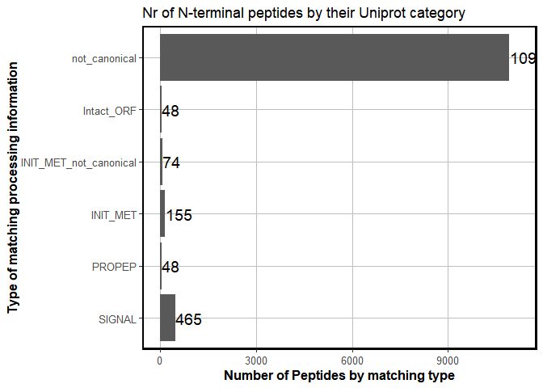
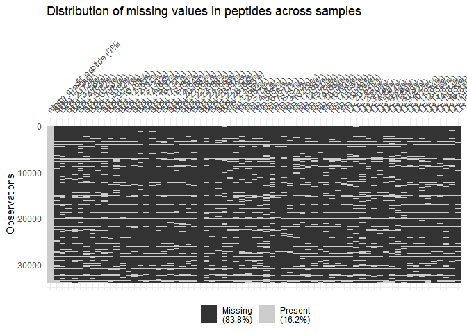
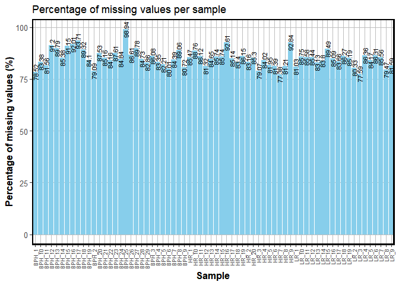
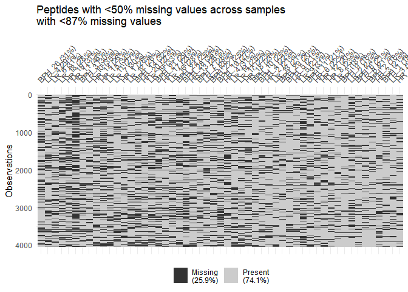
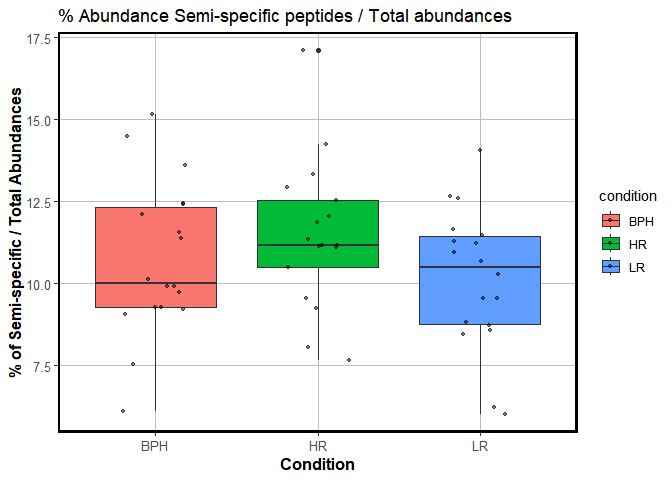
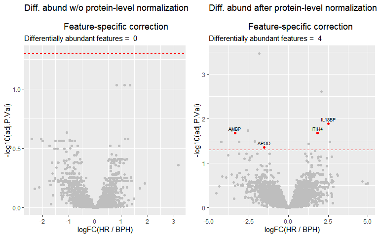
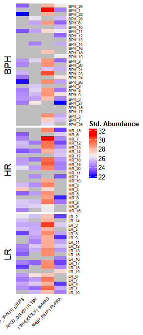
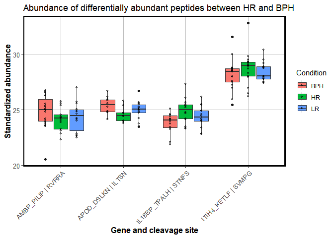

# Terminomics analysis of label-free proteomics: label-free example


- [Background and general description of the data analysis
  approach](#background-and-general-description-of-the-data-analysis-approach)
- [Short description of database search and quantitation
  approach](#short-description-of-database-search-and-quantitation-approach)
- [Required R packages](#required-r-packages)
- [Load required data](#load-required-data)
- [Annotation of peptide
  specificities](#annotation-of-peptide-specificities)
- [Visualization of peptide counts by N-terminal modification and
  specificity](#visualization-of-peptide-counts-by-n-terminal-modification-and-specificity)
- [Annotation of protein termini by Uniprot-annotated processing
  information](#annotation-of-protein-termini-by-uniprot-annotated-processing-information)
- [Quantitative analysis of
  Neo-termini](#quantitative-analysis-of-neo-termini)
- [Differential abundance analysis of potential neo-termini (without
  protein-level
  normalization)](#differential-abundance-analysis-of-potential-neo-termini-without-protein-level-normalization)
- [Differential abundance analysis of potential neo-termini (after
  protein-level
  normalization)](#differential-abundance-analysis-of-potential-neo-termini-after-protein-level-normalization)
- [Visualization of differential abundance
  results](#visualization-of-differential-abundance-results)
- [Check presence of these peptides in data before
  imputation](#check-presence-of-these-peptides-in-data-before-imputation)

Here we showcase the use of *TermineR* for the processing of Fragpipe
search results after a shotgun label-free search (DDA) without
biochemical enrichment of N-terminal peptides. We explore the
differential abundance of potential proteolytic products between two
conditions (BPH vs HR) from urine samples.

# Background and general description of the data analysis approach

# Short description of database search and quantitation approach

We used the FragPipe (v21.1) bioinformatic pipeline for database search,
re-scoring and quantitation.

In brief, we used MSFragger for peptide-to-spectrum matching against
canonical mouse sequences (EBI reference proteomes, version 2021_04). We
used trypsin semi-specificity for this label-free explorative approach.
Acetylation at peptide N-term was set as variable modification.
Carbamidomethylation of C were set as fixed modifications.

MSBooster was to predict spectra and retention times which were used as
an input for Percolator for probabilistic rescoring and FDR control of
peptide identifications.

# Required R packages

**TermineR installation and/or loading**

``` r
if (!require("TermineR", quietly = TRUE))
{        
    devtools::install_github("MiguelCos/TermineR")
}
```

**Required R packages**

``` r
## Required packages ----
library(TermineR)
library(tidyverse)
library(limma)
library(clusterProfiler)
library(org.Mm.eg.db)
library(here)
library(janitor)
library(seqinr)
library(ggpubr)
library(ggsignif)
library(ggrepel)
library(SummarizedExperiment)
library(pheatmap)
library(RColorBrewer)
```

# Load required data

## Load the peptide-level quantitation data (`fragpipe_lf_adapter`)

For a FragPipe analysis, we only need to define the location of our
Fragpipe output folder.

``` r
# define the location of the Fragpipe output folder
fragpipe_out_location <-  here::here("data-raw/proca_shotgun_label_free_semi_tryptic")
```

Then we can use the `fragpipe_lf_adapter` function to generate a data
frame with the peptide-level quantitation information, including
standardized reporter ion intensities, peptide sequences, and N-terminal
modifications.

``` r
df_from_fragpipe <- fragpipe_lf_adapter(
  parent_dir = fragpipe_out_location,
  annotation_file_path = here::here("data-raw/proca_shotgun_label_free_semi_tryptic/annotation.txt"),
  grouping_var = "nterm_modif_peptide"
)
```

## Load sample annotation data

We need a file that provides information regarding the sample names,
run, and the experimental condition. This file is used for downstream
analysis and plotting.

For label-free approaches, we need to create an annotation file
(`annotation.txt`) that contains at least two columns: `run`, with the
name of the MS/MS file as appearing in the `psm.tsv` table; and
`sample_name` with a readable sample name defined by the user, usually
defining the experimental condition and replicate number (i.e.,
`control_1`, `control_2`, `treatment_1`, `treatment_2`, etc.). An
example `annotation.txt` for `fragpipe_lf_adapter` can be found in this
repo.

Here we generate we use the annotation file to generate tabular
annotation info with the information required for downstream analysis,
mapping run, sample names and experimental conditions.

``` r
# load data
sample_annotation <- read_tsv(
  here::here("data-raw/proca_shotgun_label_free_semi_tryptic/annotation.txt")) %>%
  # add condition information
  dplyr::mutate(
    condition = case_when(
      str_detect(sample, "BPH") ~ "BPH",
      str_detect(sample, "HR") ~ "HR",
      str_detect(sample, "LR") ~ "LR",
      TRUE ~ "empty"
    )
  ) 
```

## Load and prepare protein annotation data

We want to have a series of data frames that allow us to map the protein
IDs to gene symbols and protein descriptions. This is important for
downstream analysis and visualization. We can get that information
directly from the `psm.tsv` file generated by FragPipe in this case.

``` r
prot_tsv <- read_tsv("data-raw/proca_shotgun_label_free_semi_tryptic/combined_protein.tsv") %>%
  janitor::clean_names()

pept_tsv <- read_tsv(here("data-raw/proca_shotgun_label_free_semi_tryptic/combined_peptide.tsv")) %>%
  janitor::clean_names()

prot2description <- prot_tsv %>%
  dplyr::select(
    protein = protein_id, 
    gene,
    protein_description = description
    ) %>%
  distinct()

prot2gene <- prot_tsv %>%
  dplyr::select(protein = protein_id,
                gene) %>%
  distinct()

pept2prot2gene <- pept_tsv %>%
  dplyr::select(
    peptide = peptide_sequence,
    protein = protein_id,
    gene,
    protein_description
  )
```

# Annotation of peptide specificities

Based on our generated `df_from_fragpipe` object using
`fragpipe_lf_adapter` (summary of modified peptides from PSMs), we can
now annotate the peptide specificities, cleavage sites and map them to
uniprot processing sites. This is done using the `annotate_neo_termini`
function.

For that, we need a fasta file with the protein sequences identified in
the search, in Uniprot format.

The users can adapt the protease specificy according to their experiment
modifying the `sense` and `specificity` arguments. The `sense` argument
can be “N” (for cleavage before the N-terminal residue) or “C” (for
cleavage after the C-terminal residue) and the `specificity` argument
can be any amino acid or a combination of amino acids.

In this case, we are using “C” and “K\|R” for trypsin-like cleavage.

Users interested in other proteases can modify these arguments
accordingly. For example: Lysarginase would require the user to define
`sense = "N"` and keep specificity “K\|R”.

``` r
annotated_df_quant <- annotate_neo_termini(
  peptides_df = df_from_fragpipe, 
  fasta_location = here::here("data-raw/proca_shotgun_label_free_semi_tryptic/human_ebi_proteome_2023_11_24.fasta"),
  sense = "C", 
  specificity = "K|R",
  organism = "human") %>% 
  mutate(cleav_len = nchar(cleavage_sequence)) %>% 
  relocate(cleav_len, .after = cleavage_sequence)
```

We now have a data frame with the annotated peptides, including the
cleavage site and the specificity of the cleavage. Let’s quickly check
how it looks:

The users can check the definitions of each column by calling the
`?annotate_neo_termini` function.

Finally, we will get a simplified version of the `annotated_df_quant`
data frame, mapping peptide sequences to proteins and genes, for
downstream analysis.

``` r
pept2prot2 <- annotated_df_quant %>%
  dplyr::select(nterm_modif_peptide, protein, peptide) %>%
  left_join(., prot2description) %>%
  distinct() 

pept2prot <- pept2prot2 %>%
  dplyr::select(nterm_modif_peptide, protein) %>%
  distinct()
```

# Visualization of peptide counts by N-terminal modification and specificity

Starting with our `annotated_df_quant` data frame, we can extract
information on the number of peptides identified for each N-terminal
modification and specificity. This information can be used to generate a
bar plot showing the distribution of peptides across the different
N-terminal modifications and specificities.

In the chunk below, we count the number of peptides for each N-terminal
modification and specificity, and then generate a bar plot showing the
distribution of peptides across these categories.

``` r
annot_counts <- annotated_df_quant %>%
  dplyr::count(specificity, 
               nterm_modif) %>%
  # add a column with the total number of peptides
  mutate(total = sum(n)) %>%
  # add a column with the percentage of peptides
  mutate(perc = n/total * 100) %>% 
  # create a category column merging semi_type and nterm
  mutate(category = paste(specificity, 
                          nterm_modif, 
                          sep = "_")) 
```

… and then generate the bar plot:

``` r
max_n <- max(annot_counts$n)

semi_counts_barplot <- ggplot(annot_counts,
       aes(x = n, 
           y = category, 
           fill = specificity)) +
  geom_col() +
  geom_text(aes(label = n), 
            hjust = -0.02, 
            size = 5) +
  labs(y = "N-termini", 
       x = "Number of peptides", 
       fill = "Specificity") +
  xlim(0, max(max_n) + 1500) +  # Set the limits here 
  theme(axis.text.x = element_text(hjust = 1, size = 10),
        axis.text.y = element_text(hjust = 1, size = 10),
        panel.background = element_blank(),
        panel.grid.major = element_line(color = "grey"),
        panel.border = element_rect(fill=NA, linewidth=1.5),
        axis.title=element_text(size = 12, face = "bold"))

print(semi_counts_barplot)
```


# Annotation of protein termini by Uniprot-annotated processing information

Our `annotated_df_quant` data frame contains information on the matching
of cleavage events in our dataset with known processing information from
Uniprot. We can use this information to generate a bar plot showing the
distribution of peptides across the different Uniprot processing
categories. We included three additional categories:

- “INIT_MET_not_canonical”: for events of methionine cleavage that are
  not annotated in Uniprot.
- “Intact_ORF”: for N-terminal peptides that represent the canonical
  start of the protein sequence, as annotated in Uniprot.
- “not_canonical”: for N-terminal peptides that do not map to any
  processing event as annotated in Uniprot.

First we prepare the data for the bar plot from the `annotated_df_quant`
data frame:

``` r
count_matches  <- annotated_df_quant %>%
  filter(
    !is.na(uniprot_processing_type)) %>%
  dplyr::count(uniprot_processing_type) %>%
  mutate(
    uniprot_processing_type = factor(
      uniprot_processing_type, 
      levels = c(
        "SIGNAL",
        "PROPEP",
        "TRANSIT",
        "INIT_MET",
        "INIT_MET_not_canonical",
        "Intact_ORF",
        "not_canonical"
      )
    )
  )
```

… and then generate the bar plot:

``` r
count_matches_plot <- ggplot(count_matches,
       aes(x = uniprot_processing_type, y = n)) +
           coord_flip() +
           geom_bar(stat = "identity") +
           geom_text(aes(label = n), hjust = -0.01, size = 5) +
           ylim(0, max(count_matches$n) + 300) +
           labs(title = "Nr of N-terminal peptides by their Uniprot category") +
           labs(y = "Number of Peptides by matching type",
                x = "Type of matching processing information") +
            theme(axis.text.x = element_text(hjust = 0.5, size = 10),
                  axis.text.y = element_text(hjust = 1, size = 10),
                  panel.background = element_blank(),
                  panel.grid.major = element_line(color = "grey"),
                  panel.border = element_rect(fill=NA, linewidth=1.5),
                  axis.title=element_text(size=12,face="bold"))

print(count_matches_plot)
```



# Quantitative analysis of Neo-termini

After annotation, we can use the standardized quantitative information
to evaluate the differential abundance of semi-specific peptides or
proteolytic products between conditions.

First, we can perform some initial data exploration to check the
distribution of missing values in the data.

## Initial data exploration

``` r
experimental_design <- sample_annotation %>% 
                    filter(condition != "empty") 
```

### Check distribution of missing values

We first extract the peptide annotation data from the
`annotated_df_quant` object.

``` r
# get peptide annotation
nterannot <- annotated_df_quant %>%
  dplyr::select(nterm_modif_peptide:protein_sequence)
```

Take the peptide quantitation data from the `annotated_df_quant` object.

``` r
# get peptide quantitation
quant_peptide_data <- annotated_df_quant %>%
  dplyr::select(nterm_modif_peptide, all_of(experimental_design$sample)) 
```

And generate a matrix with the peptide quantitation data.

In this case, we will generate a matrix excluding peptides with more
than 50% missing values across all samples, and another matrix including
missing values.

``` r
# exclude peptides (rows) that have > 50% missing values across all columns

peptide_50perc_miss_matrix <- quant_peptide_data %>%
  dplyr::filter(rowMeans(is.na(.)) < 0.5)
```

``` r
# peptide summary 
peptide_nona_matrix <- quant_peptide_data %>%
                    column_to_rownames("nterm_modif_peptide") %>% 
                    na.omit() %>%
                    as.matrix()

# peptides including missing values
peptide_matrix <- quant_peptide_data %>%
                    column_to_rownames("nterm_modif_peptide") %>% 
                    as.matrix()
```

Then we can visualize the distribution of missing values in the peptide
quantitation data.

``` r
naniar::vis_miss(quant_peptide_data, warn_large_data = FALSE) + 
  ggtitle("Distribution of missing values in peptides across samples") 
```



``` r
naniar::vis_miss(peptide_50perc_miss_matrix) + 
  ggtitle("Peptides with <50% missing values across samples") 
```


There is a high level of missingness in the data, so we will need some
preprocessing to move forward with quantitative analyses of the
neo-termini.

We first plot the % of missing values per sample to identify samples
with a high percentage of missing values.

``` r
# calculate the percentage of missing values per column in quant_peptide_data
# generate a data frame with the percentage of missing values per column

missing_values <- quant_peptide_data %>%
  summarise_all(~sum(is.na(.))/n()) %>%
  pivot_longer(cols = -nterm_modif_peptide, 
  names_to = "sample", 
  values_to = "perc_miss") %>%
  mutate(perc_miss = perc_miss * 100) %>%
  arrange(desc(perc_miss))

samples_with_less_87perc_miss <- missing_values %>%
  filter(perc_miss < 87) %>%
  pull(sample)
```

``` r
# generate bar plot to see percentageof missing values per sample

missing_values_plot <- ggplot(missing_values, 
       aes(x = sample, 
           y = perc_miss)) +
  geom_bar(stat = "identity", 
           fill = "skyblue") +
  geom_text(aes(label = round(perc_miss, 2)), 
            vjust = 0.5,
            # change angle to 90 degrees
            angle = 90,
            size = 3) +
  labs(x = "Sample", 
       y = "Percentage of missing values (%)", 
       title = "Percentage of missing values per sample") +
  theme(axis.text.x = element_text(
    hjust = 1, vjust = 0.5,  size = 7, angle = 90),
        axis.text.y = element_text(
          hjust = 1, vjust = 0.5, size = 10),
        panel.background = element_blank(),
        panel.grid.major = element_line(color = "grey"),
        panel.border = element_rect(fill=NA, linewidth=1.5),
        axis.title=element_text(size=12,face="bold"))
        
print(missing_values_plot)
```



We exclude the samples with more than 87% missing values (almost empty).
And keep only peptides that are present in 50% of the samples.

``` r
# peptides including missing values
peptide_less_87perc_df <- quant_peptide_data %>%
                    column_to_rownames("nterm_modif_peptide") %>% 
                    dplyr::select(all_of(samples_with_less_87perc_miss)) 

peptide_less_87perc_matrix <- peptide_less_87perc_df %>%
                    as.matrix()

# from this matrix, keep only peptides present in > 50% of the samples

peptide_50perc_less_87perc_df <- peptide_less_87perc_df %>%
  dplyr::filter(rowMeans(is.na(.)) < 0.5)

# transform into a matrix
peptide_50perc_less_87perc_matrix <- peptide_50perc_less_87perc_df %>%
  as.matrix()
```

We can visualize this:

``` r
naniar::vis_miss(peptide_50perc_less_87perc_df) + 
  ggtitle("Peptides with <50% missing values across samples\nwith <87% missing values")
```



### Impute missing values

In order to allow differential abundance analysis, we need to impute the
missing values in the peptide quantitation data. We will use the
`impSeqRob` function from the `rrcovNA` package to impute the missing
values in the peptide quantitation data after filtering.

``` r
if(!file.exists(here("data-raw/proca_shotgun_label_free_semi_tryptic/after_impseqrob_imput_peptide_abund_peptid_50perc_sample_less_87perc_miss_df.tsv"))){

  library(rrcovNA)
  # impute missing values

  # input using impSeqRob

  imputed_peptide_impseqrob <- impSeqRob(peptide_50perc_less_87perc_matrix)

  imputed_peptide_impseqrob_df <- imputed_peptide_impseqrob %>%
    as.data.frame() %>%
    rownames_to_column("nterm_modif_peptide")  %>% 
  dplyr::select(-c(outl, flag))

  write_tsv(
    imputed_peptide_impseqrob_df,
    "data-raw/proca_shotgun_label_free_semi_tryptic/after_impseqrob_imput_peptide_abund_peptid_50perc_sample_less_87perc_miss_df.tsv")

} else {

  imputed_peptide_impseqrob_df <- read_tsv(
    "data-raw/proca_shotgun_label_free_semi_tryptic/after_impseqrob_imput_peptide_abund_peptid_50perc_sample_less_87perc_miss_df.tsv"
  ) 

  imputed_peptide_impseqrob <- imputed_peptide_impseqrob_df %>%
    column_to_rownames("nterm_modif_peptide") %>%
    as.matrix()

}
```

``` r
# change the column names to exclude the 'x.' using `renate_at`
imputed_peptide_impseqrob_df <- imputed_peptide_impseqrob_df %>%
  rename_at(vars(starts_with("x.")), ~str_remove(., "x.")) 

imputed_peptide_impseqrob <- imputed_peptide_impseqrob_df %>%
  column_to_rownames("nterm_modif_peptide") %>%
  as.matrix()
```

## Set up the `SummarizedExperiment` objects

For reproducibility and to facilitate downstream analysis, we will use
the `SummarizedExperiment` class to store the quantitative information.
This type of object allows to store column metadata (sample, condition
and experimental design) together with row metadata (peptide
annotation).

We will generate two `SummarizedExperiment` objects: one for the
standardized abundances and one for the raw intensities. The latter will
be used for protein-level normalization.

### Prepare the experimental design information

We here generate an `experimental_design` object that contains the
sample condition and experimental design information. This is used to
generate the `SummarizedExperiment` object below.

``` r
experimental_design <- sample_annotation %>% 
                    filter(condition != "empty") %>% 
                    # keep only samples that were used in the imputation
                    filter(sample %in% colnames(imputed_peptide_impseqrob)) %>%
                    # arrange rows to have the same order as colnames(imputed_peptide_impseqrob)
                    arrange(match(sample, colnames(imputed_peptide_impseqrob)))         
```

### `SummarizedExperiment` for scaled abundances

From the peptide annotation data, we need to filter the peptides that
are present in the peptide quantitation matrix.

``` r
# select modified peptide annotations in the right order from the nterannot object.
annotated_peptides_nona <- nterannot %>%
  filter(nterm_modif_peptide %in% rownames(imputed_peptide_impseqrob)) %>%
  arrange(match(nterm_modif_peptide, rownames(imputed_peptide_impseqrob)))
```

… and finally create the `SummarizedExperiment` object for the scaled
abundances.

``` r
# create summarized experiment object for non-NA peptides (pure_pet_nona_matrix) 
# and non-NA proteins (annotated_best_psms_nona)
data_pept_se_nona <- SummarizedExperiment(
                                          assays = list(counts = imputed_peptide_impseqrob),
                                          colData = experimental_design,
                                          rowData = annotated_peptides_nona
                                          )
```

### `SummarizedExperiment` for raw-intensities

Starting for the matrix of standardized peptide abundances generated
above (`imputed_peptide_impseqrob`), we can reverse the log2
transformation to get the raw intensities. This is performed in order to
execute protein-level normalization downstream.

``` r
# get raw intensity values by reversing the log2 scaled abundances
peptide_raw_nona_matrix <- apply(
  imputed_peptide_impseqrob, 
  c(1,2), 
  function(x) 2^x)
```

And then generate the `SummarizedExperiment` object for the raw
intensities.

``` r
# create summarized experiment object for raw intensities
# this will be used later for protein-level abundance normalization 

data_pept_raw_se_nona <- SummarizedExperiment(
                                              assays = list(counts = peptide_raw_nona_matrix),
                                              colData = experimental_design,
                                              rowData = annotated_peptides_nona
                                              )
```

## % of total summed abundance of neo-termini by the total summed abundance of all peptides (raw intensities)

As an exemplary exploratory analysis, we showcase the calculation of the
percentage of total summed abundance of potential proteolytic products
(defined by peptides semi-specific peptides, in this experiment) by the
total summed abundance of all peptides (raw intensities).

This can be used as a proxy to evaluate the relative abundance of
proteolytic products between experimental conditions.

``` r
# extract peptide level data from summarized experiment object

mat_df_rawpur_nona <- as.data.frame(assay(data_pept_raw_se_nona))

col_dat_df_rawpur_nona <- data.frame(colData(data_pept_raw_se_nona))

row_dat_df_rawpur_nona <- data.frame(rowData(data_pept_raw_se_nona))

# transform into long format

mat_df_rawpur_nona_long <- mat_df_rawpur_nona %>%
  tibble::rownames_to_column("nterm_modif_peptide") %>%
  tidyr::pivot_longer(cols = where(is.numeric), 
                      names_to = "sample", 
                      values_to  = "Intensity") %>%
  dplyr::left_join(., col_dat_df_rawpur_nona, 
                   by = "sample") %>%
  dplyr::left_join(., row_dat_df_rawpur_nona,
                   by = "nterm_modif_peptide") 

# use the long format data to plot the distribution of normalized abundances
# of proteolytic products

# filter long data to keep only proteolytic products
mat_df_rawpur_nona_long_proteolytic <- mat_df_rawpur_nona_long %>%
  dplyr::filter(specificity != "specific") 

pept_summ_rawpur_semi_1 <- mat_df_rawpur_nona_long_proteolytic %>% 
  group_by(sample, condition) %>%
  summarise(`Summed Abundances Semis` = sum(Intensity, na.rm = TRUE)) 

# get the summ of all peptides per sample/condition 
pept_summ_rawpur_all <- mat_df_rawpur_nona_long %>% 
  group_by(sample, condition) %>%
  summarise(`Summer Abundances Total` = sum(Intensity, na.rm = TRUE)) 

# merge the two data frames to get the normalized abundances of proteolytic products
pept_summ_rawpur_semi_3 <- pept_summ_rawpur_semi_1 %>%
  dplyr::left_join(., pept_summ_rawpur_all, 
                   by = c("sample", "condition")) %>%
  mutate(`% of Semi/Total Abundances` = `Summed Abundances Semis`/`Summer Abundances Total` * 100 )
```

``` r
boxplots_percentages <- ggplot(pept_summ_rawpur_semi_3, 
        aes(x = condition, 
            y = `% of Semi/Total Abundances`,
            fill = condition)) +
  geom_boxplot() +
  # add jittered dots for data points
  geom_jitter(width = 0.2, 
              height = 0, 
              alpha = 0.5, 
              size = 1) +
  #geom_signif(
  #  comparisons = list(c("BPH", "HR", "LR")),
  #  map_signif_level = TRUE
  #) + 
  #stat_compare_means(method="wilcox.test") +
  labs(x = "Condition",
       y = "% of Semi-specific / Total Abundances",
       title = "% Abundance Semi-specific peptides / Total abundances") +
  theme(axis.text.x = element_text(hjust = 0.5, size = 10),
        axis.text.y = element_text(hjust = 1, size = 10),
        panel.background = element_blank(),
        panel.grid.major = element_line(color = "grey"),
        panel.border = element_rect(fill=NA, linewidth=1.5),
        axis.title=element_text(size=12,face="bold"))

print(boxplots_percentages)
```



# Differential abundance analysis of potential neo-termini (without protein-level normalization)

## Prepare the abundance matrix

We extract the abundance matrix from the `data_pept_se_nona`
`SummarizedExperiment` object

``` r
mat <- assay(data_pept_se_nona) 
```

## Set up the design matrix

We set up the design matrix for the differential abundance analysis. In
this case, we are comparing the abundance of peptides between two
conditions (HR and BPH). We extract the condition information from the
`colData` of the `data_pept_se_nona` object.

``` r
# extract the condition from the colData of the summarized experiment object
condition <- colData(data_pept_se_nona)$condition

design <- model.matrix(~ 0 + condition)

rownames(design) <- rownames(colData(data_pept_se_nona))

colnames(design) <- str_remove(colnames(design), "condition")
```

## Run *limma* differential abundance analysis

``` r
fit <- lmFit(object = mat, 
             design = design, 
             method = "robust")
```

We define the contrast:

``` r
cont.matrix <- makeContrasts(
                             HR_vs_BPH = HR - BPH,
                             levels = design)
```

``` r
fit2 <- contrasts.fit(fit, 
                      cont.matrix)

fit2 <- eBayes(fit2)
```

## Generate `topTable` with comparison results

We generate the `topTable` with the comparison results, including the
log2 fold change, p-values and adjusted p-values, and we merge this
information with the peptide annotation data (from the `rowData` of the
`data_pept_se_nona` object).

### HR vs BPH

``` r
HR_vs_BPH_peptides_limma <- topTable(fit = fit2, 
                                    coef = "HR_vs_BPH",
                                    number = Inf, 
                                    adjust.method = "BH") %>%
  rownames_to_column("nterm_modif_peptide") %>%
  left_join(., as.data.frame(rowData(data_pept_se_nona)))
```

## Feature-specific FDR correction

We can now apply a feature-specific FDR correction to the comparison
results. This means that we will correct the p-values for multiple
testing only for the interesting features, in this case, what we define
as potential proteolytic products. As described before, the definition
of interesting features is experiment and context dependent and should
be defined by the user. In this case, we will consider as interesting
features as any peptides that are semi-specific.

We extract this information from the rowData of the `data_pept_se_nona`
object.

``` r
peptide_data_annotation <- as.data.frame(rowData(data_pept_se_nona)) %>%
  mutate(
    neo_termini_status = case_when(
      specificity != "specific" ~ "neo_termini",
      TRUE ~ "not_neo_termini"
  ))
```

Now we can define the interesting features for the feature-specific FDR
correction:

``` r
# keep only peptides with interesting features 
interesting_features <- peptide_data_annotation %>%
  filter(neo_termini_status == "neo_termini") %>% 
  distinct()
```

And apply our function `feature_fdr_correction`:

### For HR vs BPH

``` r
compar_tab_feat_fdr_HR_vs_BPH <- feature_fdr_correction(toptable = HR_vs_BPH_peptides_limma,
                                              interesting_features_table = interesting_features,
                                              method = "BH") %>%
  # and annotate the data frame for downstream analysis
  distinct() %>%
  left_join(.,peptide_data_annotation) %>%
  mutate(Feature = if_else(condition = adj.P.Val < 0.05 & fdr_correction == "feature-specific",
                        true = "Differentially abundant",
                        false = "Unchanged")) %>% 
  mutate(Change_direction = case_when((Feature == "Differentially abundant" &
                                        logFC > 0) &
                                        neo_termini_status == "neo_termini" ~ "Up-regulated",
                                      (Feature == "Differentially abundant" &
                                        logFC < 0) &
                                        neo_termini_status == "neo_termini" ~ "Down-regulated",
                                      TRUE ~ "Unchanged/Specific")) %>%
  mutate(Change_direction = factor(Change_direction,
                                   levels = c("Unchanged/Specific",
                                              "Up-regulated",
                                              "Down-regulated"))) %>%
  left_join(., pept2prot2gene)
```

# Differential abundance analysis of potential neo-termini (after protein-level normalization)

We need to normalize the peptide abundances based on the abundances of
the proteins they belong to. This is done using the
`peptide2protein_normalization` function.

This function perform the next processing steps:

- 1.  Get a peptide abundance matrix (raw abundances).
- 2.  Summarize the abundances to protein abundances based on unique
      fully-specific peptides (this is optional but it’s set as such by
      default). This means: we assume that the abundance of a protein is
      represented by the abundance of its unique fully-specific
      peptides.
- 3.  Calculate the peptide to protein ratio.
- 4.  Calculate the fraction of abundance of each peptide which is
      representative of the whole protein abundance.
- 5.  Log2-transform this abundance values and normalize by median
      centering.

The `peptide2protein_normalization` function requires a `peptides` data
frame with minimal peptide information and quantitative data, a
`sample_annotation` data frame with the sample information, and a
`peptide_annot` data frame with the peptide specificity information.

We need to prepare the inputs for the function.

First we need to generate a quantative dataframe with the peptide raw
abundances and the peptide annotation. It should contain the columns
‘nterm_modif_peptide’, ‘protein’ and the sample names as columns. We
extract this information from the `data_pept_raw_se_nona` object.

``` r
# get peptide raw quant 
pept_q_raw_nona <- assay(data_pept_raw_se_nona) %>%
  as.data.frame() %>%
  rownames_to_column("nterm_modif_peptide") %>%
  left_join(., dplyr::select(as.data.frame(rowData(data_pept_raw_se_nona)),
    nterm_modif_peptide,
    peptide,
    protein,
    nterm_modif,
    specificity
  )) %>%
  relocate(
    nterm_modif_peptide,
    peptide,
    protein,
    nterm_modif,
    specificity)
```

… and the peptide annotation data frame.

``` r
# preparing input for peptide2protein_normalization function
pept_q_raw_nona_annot <- pept_q_raw_nona %>%
  dplyr::select(
    nterm_modif_peptide,
    peptide,
    protein,
    nterm_modif,
    specificity
  )
```

We need to define `summary_by_specificity` as `TRUE`, to summarize the
peptide abundances by specificity. This means that we will calculate the
protein abundance based on the abundances of fully specific peptides
only, as a proxy for the protein abundance.

``` r
protein_normalized_peptides <- peptide2protein_normalization(
  peptides = pept_q_raw_nona,
  annot = experimental_design, 
  peptide_annot = pept_q_raw_nona_annot, 
  summarize_by_specificity = TRUE
  )
```

The output of this function is a list with 4 elements: -
`protein_normalized_pepts_scaled`: a data frame with the
protein-normalized peptide abundances, log2-transformed and
median-centered. - `protein_normalized_pepts_abundance`: a data frame
with the protein-normalized peptide abundances, log2-transformed. -
`protein_normalized_pepts_abundance`:Matrix of peptide abundances
non-scaled, after extracting fraction of peptide/protein fraction of
abundance. - `summarized_protein_abundance`: Summarized protein
abundances based on peptide matrix. -
`summarized_protein_abundance_scaled`: Summarized protein abundances
based on peptide matrix, standardized. - `summarize_by_specificity`:
Object showing if the protein abundances were summarized by specific
peptides.

We would use them later when evaluating relationship between protein
abundance and their associated proteolytic products.

## Prep summarizedExperiment object from protein-normalized abundances

After peptide-to-protein normalization, we can generate a
`SummarizedExperiment` object with the protein-normalized peptide
abundances. This object will be used for the differential abundance
analysis.

``` r
# peptide summary 

# merge annotation and quant 
pure_pet_protnorn_mat_annot <- left_join(
  protein_normalized_peptides$protein_normalized_pepts_scaled,
  as.data.frame(rowData(data_pept_raw_se_nona))
)

# get peptide quant
mat_prot_norm <- pure_pet_protnorn_mat_annot %>%  
  dplyr::select(
    nterm_modif_peptide,
    matches("fraction_int_")
  ) %>%
  column_to_rownames("nterm_modif_peptide") %>%
  as.matrix()

colnames(mat_prot_norm) <- str_remove(
  colnames(mat_prot_norm), 
  "fraction_int_peptide2prot_"
)

# get peptide annotation

annot_prot_norm <- pure_pet_protnorn_mat_annot %>%
  dplyr::select(
    nterm_modif_peptide,
    nterm_modif:protein_sequence
  )

# create summarized experiment object for non-NA peptides (pure_pet_nona_matrix) 
# and non-NA proteins (annotated_best_psms_nona)

data_pept_protnorn_pur_se_nona <- SummarizedExperiment(
  assays = list(counts = mat_prot_norm),
  colData = experimental_design,
  rowData = annot_prot_norm)
```

The matrix after normalization by protein abundance will contain less
peptides. This is because some proteins were only identified by
semi-specific peptides.

## Prep abundance matrix

``` r
mat_pept_protnorm <- assay(data_pept_protnorn_pur_se_nona) %>%
  na.omit()
```

## Set up design matrix

``` r
condition <- colData(data_pept_protnorn_pur_se_nona)$condition

design <- model.matrix(~ 0 + condition)

rownames(design) <- rownames(colData(data_pept_protnorn_pur_se_nona))

colnames(design) <- str_remove(colnames(design), "condition")
```

## Run *limma* differential abundance analysis

``` r
fit_n1 <- lmFit(object = mat_pept_protnorm, 
                design = design, 
                method = "robust")
```

The contrast matrix here is the same we defined in the first *limma*
analysis.

``` r
fit_n2 <- contrasts.fit(fit_n1, 
                        cont.matrix)

fit_n2 <- eBayes(fit_n2)
```

## Generate `topTable` with comparison results

### HR vs BPH

``` r
HR_vs_BPH_peptides_prot_norm_limma <- topTable(fit = fit_n2, 
                                    coef = "HR_vs_BPH",
                                    number = Inf, 
                                    adjust.method = "BH") %>%
  rownames_to_column("nterm_modif_peptide") %>%
  left_join(., as.data.frame(rowData(data_pept_protnorn_pur_se_nona)))
```

## Feature-specific FDR correction

### For HR vs BPH

``` r
compar_tab_pept_protein_normalized_feat_fdr_HR_vs_BPH <- feature_fdr_correction(
  toptable = HR_vs_BPH_peptides_prot_norm_limma,
  interesting_features,
  method = "BH") %>%
  # annotation of the resulting data frame
  distinct() %>%
  left_join(.,peptide_data_annotation) %>%
  mutate(Feature = if_else(condition = adj.P.Val < 0.05 & fdr_correction == "feature-specific",
                        true = "Differentially abundant",
                        false = "Unchanged")) %>% 
  mutate(Change_direction = case_when((Feature == "Differentially abundant" &
                                        logFC > 0) &
                                        neo_termini_status == "neo_termini" ~ "Up-regulated",
                                      (Feature == "Differentially abundant" &
                                        logFC < 0) &
                                        neo_termini_status == "neo_termini" ~ "Down-regulated",
                                      TRUE ~ "Unchanged/Specific")) %>%
  mutate(Change_direction = factor(Change_direction,
                                   levels = c("Unchanged/Specific",
                                              "Up-regulated",
                                              "Down-regulated"))) %>%
  left_join(., pept2prot2gene)
```

# Visualization of differential abundance results

We want now to quickly see the results of the differential abundance
analysis. It is interesting to see how these change between
protein-normalized abundances and non-normalized abundances.

## HR vs BPH

Let’s first prepare the data for visualization.

``` r
# differentially and non-differentially abundant peptides from the non-protein-normalized data
HR_vs_BPH_peptides_limma_table_diff_feat_spec_fdr <- compar_tab_feat_fdr_HR_vs_BPH %>%
  filter(Change_direction %in% c("Up-regulated",
                                 "Down-regulated"))

HR_vs_BPH_peptides_limma_table_nodiff_feat_spec_fdr <- compar_tab_feat_fdr_HR_vs_BPH %>%
  filter(!Change_direction %in% c("Up-regulated",
                                 "Down-regulated"))

# differentially and non-differentially abundant peptides from the protein-normalized data

HR_vs_BPH_peptides_limma_table_n1_diff_feat_spec_fdr <- compar_tab_pept_protein_normalized_feat_fdr_HR_vs_BPH %>%
  filter(Change_direction %in% c("Up-regulated",
                                 "Down-regulated"))

HR_vs_BPH_peptides_limma_table_n1_nodiff_feat_spec_fdr <- compar_tab_pept_protein_normalized_feat_fdr_HR_vs_BPH %>%
  filter(!Change_direction %in% c("Up-regulated",
                                 "Down-regulated"))

# upreg

HR_vs_BPH_peptides_limma_table_n1_diff_feat_spec_fdr_upreg <- HR_vs_BPH_peptides_limma_table_n1_diff_feat_spec_fdr %>%
  filter(Change_direction == "Up-regulated")

# downreg

HR_vs_BPH_peptides_limma_table_n1_diff_feat_spec_fdr_downreg <- HR_vs_BPH_peptides_limma_table_n1_diff_feat_spec_fdr %>%
  filter(Change_direction == "Down-regulated")
```

… generate the volcano plot objects

``` r
# non-normalized DE results
volcano_limma_HR_vs_BPH <- ggplot(compar_tab_feat_fdr_HR_vs_BPH, 
       aes(x = logFC, 
           y = -log10(adj.P.Val))) +
  geom_point(data = HR_vs_BPH_peptides_limma_table_nodiff_feat_spec_fdr,
             color = "grey") +  
  geom_point(data = HR_vs_BPH_peptides_limma_table_diff_feat_spec_fdr, 
             color = "red") + 
  geom_hline(yintercept = -log10(0.05),
             color = "red", 
             linetype = "dashed") +
  geom_text(
    data = HR_vs_BPH_peptides_limma_table_diff_feat_spec_fdr,
    aes(label = gene),
    nudge_y = 0.5,
    check_overlap = TRUE,
    size = 2.5) +
  xlab("logFC(HR / BPH)") +
  labs(title = "Diff. abund w/o protein-level normalization\n 
                Feature-specific correction",
       subtitle = paste("Differentially abundant features = ",
                        nrow(HR_vs_BPH_peptides_limma_table_diff_feat_spec_fdr))) 

# protein-normalized DE results
volcano_pept_norm_limma_HR_vs_BPH <- ggplot(compar_tab_pept_protein_normalized_feat_fdr_HR_vs_BPH, 
       aes(x = logFC, 
           y = -log10(adj.P.Val))) +
  geom_point(data = HR_vs_BPH_peptides_limma_table_n1_nodiff_feat_spec_fdr,
             color = "grey") +  
  geom_point(data = HR_vs_BPH_peptides_limma_table_n1_diff_feat_spec_fdr, 
             color = "red") + 
  geom_hline(yintercept = -log10(0.05),
             color = "red", 
             linetype = "dashed")  +
  geom_text(
    data = HR_vs_BPH_peptides_limma_table_n1_diff_feat_spec_fdr,
    mapping  = aes(label = gene),
    check_overlap = TRUE,
    nudge_y = 0.1,
    size = 2.5) +
  xlab("logFC(HR / BPH)") +
  labs(title = "Diff. abund after protein-level normalization\n 
                Feature-specific correction",
       subtitle = paste("Differentially abundant features = ",
                        nrow(HR_vs_BPH_peptides_limma_table_n1_diff_feat_spec_fdr))) 
```

Visualize both plots side-by-side:

``` r
cowplot::plot_grid(
  volcano_limma_HR_vs_BPH,
  volcano_pept_norm_limma_HR_vs_BPH,
  nrow = 1)
```



After protein-level normalization, we can see four semi-specific
peptides that are differentially abundant between HR and BPH samples.
These are related to AMBP, APOD, ITIH4 and IL18BP.

# Check presence of these peptides in data before imputation

We performed our differential abundance analysis based on the imputed
data. It is important to check if these peptides were present in the
data before imputation. This is important to evaluate if the imputation
process introduced any bias in the results.

## Heatmap of diff. abund. peptides between HR and BPH

Extract the peptides that are differentially abundant between HR and BPH
samples.

``` r
diff_abund_peptides_HR_vs_BPH <- HR_vs_BPH_peptides_limma_table_n1_diff_feat_spec_fdr %>%
  pull(nterm_modif_peptide)
```

Get peptide cleavage annotation:

``` r
annot_df_quant_inter_pept_HR_vs_BPH <- annotated_df_quant %>%
  filter(nterm_modif_peptide %in% diff_abund_peptides_HR_vs_BPH) %>% 
  left_join(., pept2prot2gene) %>% 
  mutate(cleavage_n_gene = paste0(
    gene, "_", cleavage_site
  ))
```

Prepare abundance matrix for heatmap visualization:

``` r
mat_pre_heatmap <- annot_df_quant_inter_pept_HR_vs_BPH %>%
  dplyr::select(
    cleavage_n_gene,
    matches("HR|BPH|LR")
  ) %>% 
  column_to_rownames("cleavage_n_gene") %>%
  as.matrix()
```

Prepare annotation for the heatmap:

``` r
col_annot_pre_heatmap <- tibble(
  sample = colnames(mat_pre_heatmap),
  condition = colnames(mat_pre_heatmap) %>% 
  # make it remove stuff after "_", including "_"
    str_remove("_.*") 
)
```

``` r
library(ComplexHeatmap)
```

Generate the heatmap:

``` r
Heatmap(
  t(mat_pre_heatmap), 
  name = "Std. Abundance", 
  row_split = col_annot_pre_heatmap$condition,
  show_row_dend = FALSE,
  show_column_dend = FALSE,
  cluster_rows = FALSE,
  cluster_columns = FALSE,
  column_names_rot = 45,
  column_names_gp = gpar(fontsize = 6),
  row_names_gp = gpar(fontsize = 6)
)
```



## Boxplots of diff. abund. peptides between HR and BPH

``` r
# pivot long this annot_df_quant_inter_pept_HR_vs_BPH

annot_df_quant_inter_pept_HR_vs_BPH_long <- annot_df_quant_inter_pept_HR_vs_BPH %>% 
dplyr::select(
    cleavage_n_gene,
    matches("HR|BPH|LR")
  ) %>%
  pivot_longer(
    cols = matches("HR|BPH|LR"),
    names_to = "sample",
    values_to = "abundance"
  ) %>% 
  mutate(
    condition = str_remove(sample, "_.*")
  )
```

``` r
boxplot_diff_abund_peptides_HR_vs_BPH <- ggplot(annot_df_quant_inter_pept_HR_vs_BPH_long, 
       aes(x = cleavage_n_gene, 
           y = abundance,
           fill = condition)) +
  geom_boxplot() +
  # add jittered dots for data points
  geom_jitter(position = position_dodge(width = 0.75), 
              alpha = 0.5, 
              size = 1) +
  labs(x = "Gene and cleavage site",
       y = "Standardized abundance",
       fill = "Condition",
       title = "Abundance of differentially abundant peptides between HR and BPH") +
  theme(axis.text.x = element_text(hjust = 1, size = 10, angle = 45),
        axis.text.y = element_text(hjust = 1, size = 10),
        panel.background = element_blank(),
        panel.grid.major = element_line(color = "grey"),
        panel.border = element_rect(fill=NA, linewidth=1.5),
        axis.title=element_text(size=12,face="bold"))
```

``` r
boxplot_diff_abund_peptides_HR_vs_BPH
```



## Session info

Package versions used to generate this report:

``` r
sessionInfo()
```

    R version 4.4.0 (2024-04-24 ucrt)
    Platform: x86_64-w64-mingw32/x64
    Running under: Windows 11 x64 (build 22631)

    Matrix products: default


    locale:
    [1] LC_COLLATE=English_United States.utf8 
    [2] LC_CTYPE=English_United States.utf8   
    [3] LC_MONETARY=English_United States.utf8
    [4] LC_NUMERIC=C                          
    [5] LC_TIME=English_United States.utf8    

    time zone: Europe/Berlin
    tzcode source: internal

    attached base packages:
    [1] grid      stats4    stats     graphics  grDevices utils     datasets 
    [8] methods   base     

    other attached packages:
     [1] ComplexHeatmap_2.16.0       magrittr_2.0.3             
     [3] RColorBrewer_1.1-3          pheatmap_1.0.12            
     [5] SummarizedExperiment_1.30.2 GenomicRanges_1.52.1       
     [7] GenomeInfoDb_1.36.4         MatrixGenerics_1.12.3      
     [9] matrixStats_1.3.0           ggrepel_0.9.4              
    [11] ggsignif_0.6.4              ggpubr_0.6.0               
    [13] seqinr_4.2-30               janitor_2.2.0              
    [15] here_1.0.1                  org.Mm.eg.db_3.17.0        
    [17] AnnotationDbi_1.62.2        IRanges_2.34.1             
    [19] S4Vectors_0.38.2            Biobase_2.60.0             
    [21] BiocGenerics_0.46.0         clusterProfiler_4.8.3      
    [23] limma_3.56.2                lubridate_1.9.2            
    [25] forcats_1.0.0               stringr_1.5.1              
    [27] dplyr_1.1.2                 purrr_1.0.1                
    [29] readr_2.1.4                 tidyr_1.3.0                
    [31] tibble_3.2.1                ggplot2_3.5.1              
    [33] tidyverse_2.0.0             TermineR_1.0.0             

    loaded via a namespace (and not attached):
      [1] splines_4.4.0           bitops_1.0-7            ggplotify_0.1.2        
      [4] polyclip_1.10-6         lifecycle_1.0.4         rstatix_0.7.2          
      [7] doParallel_1.0.17       rprojroot_2.0.4         lattice_0.22-5         
     [10] vroom_1.6.4             MASS_7.3-60             backports_1.4.1        
     [13] rmarkdown_2.25          yaml_2.3.7              cowplot_1.1.1          
     [16] DBI_1.1.3               ade4_1.7-22             abind_1.4-5            
     [19] zlibbioc_1.46.0         ggraph_2.1.0            RCurl_1.98-1.13        
     [22] yulab.utils_0.1.0       tweenr_2.0.2            circlize_0.4.15        
     [25] GenomeInfoDbData_1.2.10 enrichplot_1.20.3       tidytree_0.4.5         
     [28] codetools_0.2-19        DelayedArray_0.26.7     DOSE_3.26.2            
     [31] ggforce_0.4.1           tidyselect_1.2.0        shape_1.4.6            
     [34] aplot_0.2.2             farver_2.1.1            viridis_0.6.4          
     [37] jsonlite_1.8.5          GetoptLong_1.0.5        tidygraph_1.2.3        
     [40] iterators_1.0.14        foreach_1.5.2           tools_4.4.0            
     [43] treeio_1.24.3           Rcpp_1.0.11             glue_1.6.2             
     [46] gridExtra_2.3           xfun_0.41               qvalue_2.36.0          
     [49] withr_3.0.0             fastmap_1.1.1           fansi_1.0.6            
     [52] digest_0.6.33           timechange_0.2.0        R6_2.5.1               
     [55] gridGraphics_0.5-1      visdat_0.6.0            colorspace_2.1-0       
     [58] GO.db_3.17.0            Cairo_1.6-1             RSQLite_2.3.3          
     [61] utf8_1.2.4              generics_0.1.3          data.table_1.15.4      
     [64] graphlayouts_1.0.2      httr_1.4.7              S4Arrays_1.0.6         
     [67] scatterpie_0.2.1        pkgconfig_2.0.3         gtable_0.3.5           
     [70] blob_1.2.4              XVector_0.40.0          shadowtext_0.1.2       
     [73] htmltools_0.5.7         carData_3.0-5           fgsea_1.26.0           
     [76] naniar_1.0.0            clue_0.3-65             scales_1.3.0           
     [79] png_0.1-8               snakecase_0.11.1        ggfun_0.1.3            
     [82] knitr_1.45              rstudioapi_0.15.0       tzdb_0.4.0             
     [85] reshape2_1.4.4          rjson_0.2.21            nlme_3.1-163           
     [88] cachem_1.0.8            GlobalOptions_0.1.2     parallel_4.4.0         
     [91] HDO.db_0.99.1           pillar_1.9.0            diann_1.0.1            
     [94] vctrs_0.6.3             car_3.1-2               cluster_2.1.4          
     [97] evaluate_0.23           cli_3.6.1               compiler_4.4.0         
    [100] rlang_1.1.1             crayon_1.5.2            labeling_0.4.3         
    [103] plyr_1.8.9              fs_1.6.2                stringi_1.7.12         
    [106] viridisLite_0.4.2       BiocParallel_1.34.2     munsell_0.5.1          
    [109] Biostrings_2.68.1       lazyeval_0.2.2          GOSemSim_2.26.1        
    [112] Matrix_1.6-3            RcppEigen_0.3.3.9.4     hms_1.1.3              
    [115] patchwork_1.1.3         bit64_4.0.5             KEGGREST_1.40.1        
    [118] igraph_2.0.3            broom_1.0.5             memoise_2.0.1          
    [121] ggtree_3.8.2            fastmatch_1.1-4         bit_4.0.5              
    [124] downloader_0.4          ape_5.7-1               gson_0.1.0             
